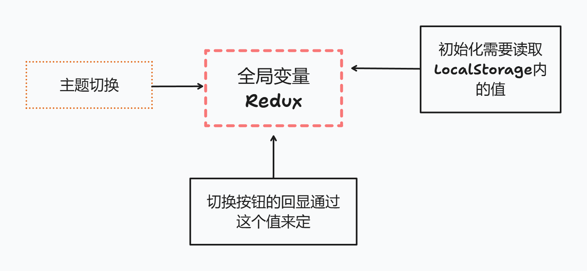
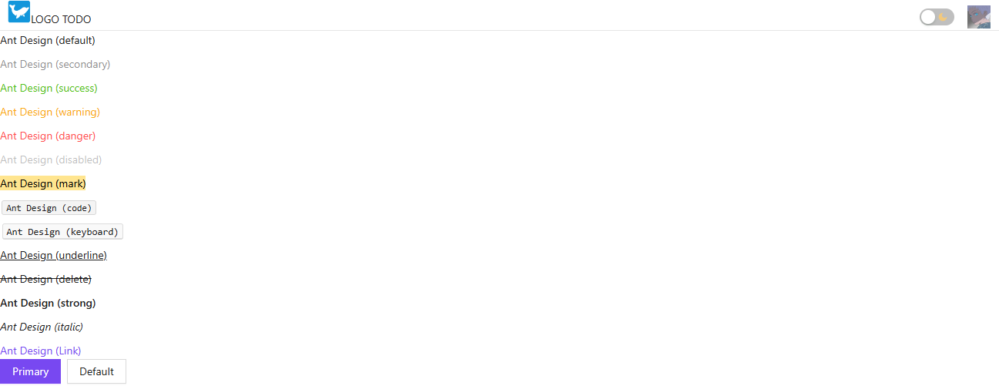

# 主题切换

:::tip Web 端或 App 端主题切换
思路:

- 使用 CSS 变量
- 使用框架的主题
- 持久化存储用户配置
  :::

## 步骤

**看了很多教程, 认为使用 CSS 变量代码简洁, 且可读性好.**



### 使用了 ant-design UI 框架, 使用自带的主题切换

以下代码可以用 ant-d 的主题配置来设置主题样式, 是我们主题切换内容的一部分, 之后通过读取`store`内的值来决定使用哪套主题就可以.

```js
//文件路径: 根路径/src/styles/theme.js
import { theme } from "antd";

export const lightTheme = {
  algorithm: theme.defaultAlgorithm,
  ...
};

export const darkTheme = {
  algorithm: theme.darkAlgorithm,
  ...
};
```

```jsx
//文件路径: 根路径/src/App.jsx
import router from "./router";
import { Button, ConfigProvider, Space, theme } from "antd";
import { lightTheme, darkTheme } from "./styles/theme.js";

export default function App() {
  return (
    <ConfigProvider theme={lightTheme}> // [!code focus]
      {router}
      <Space>
        <Button type="primary">Primary</Button>
        <Button>Default</Button>
      </Space>
    </ConfigProvider>
  );
}
```

### 使用 CSS 变量

ant-d 自带的主题配置不能完全满足定制需求, 比如一些`div`的`border`颜色之类的值在不同主题下也应该是不同的颜色.

这里通过`html`的自定义数据属性来决定使用哪套样式, 大致做法:

```scss
//文件路径: 根路径/src/styles/index.scss
/** light-default */
:root {
  --g-border-color: #e5e5e5;
  --g-background-color: #ffffff;
}

/** dark */
html[data-theme="dark"] {
  --g-border-color: #203251;
  --g-background-color: #000000a9;
}

/** 全局头部样式 */
.global-header {
  border-bottom: 1px solid var(--g-border-color);
  ...
}
```

```js
//设置自定义数据属性
document.documentElement.dataset.theme = "dark";
```

### 使用 Redux 与 redux-persist 持久化数据

安装与基本示例就不赘述了

```js
//文件路径: 根路径/src/store/index.js
import { configureStore } from "@reduxjs/toolkit";
import storage from "redux-persist/lib/storage";
import { combineReducers } from "redux";
import { persistReducer, persistStore } from "redux-persist";

//创建的reducer
import userReducer from "./user.js"; //用户数据

// combineReducers合并reducer
const reducers = combineReducers({
  user: userReducer,
});

const persistConfig = {
  key: "root",
  storage,
  //白名单
  whitelist: ["user"],
  keyPrefix: "", //移除 'persist:' 前缀
};

const persistedReducer = persistReducer(persistConfig, reducers);

export const store = configureStore({
  reducer: persistedReducer,
  middleware: (getDefaultMiddleware) =>
    getDefaultMiddleware({
      //关闭序列化状态检测中间件
      serializableCheck: false,
    }),
});

export const persistor = persistStore(store);
```

```js
//文件路径: 根路径/src/store/user.js
import { createSlice } from "@reduxjs/toolkit";
import { getLocalStorageRoot } from "../utils/index";
export const userSlice = createSlice({
  name: "user",
  initialState: {
    theme: getLocalStorageRoot()?.user.theme === "light" ? "dark" : "light", //主题类型 true(dark)/false(light)
  },
  reducers: {
    toggleTheme: (state) => {
      state.theme = state.theme === "light" ? "dark" : "light";
    },
  },
});

export const { toggleTheme } = userSlice.actions;
export const selectTheme = (state) => state.user.theme;

export default userSlice.reducer;
```

`getLocalStorageRoot()`这个方法获取`LocalStorage`存储的值, 但是使用`redux-persist`存储的值的内层默认是`JSON`格式, 一直没查到怎么默认存储成对象格式格式的, **待改进**.

```js
//文件路径: 根路径/src/utils/index.js
/**
 * 本地存储的JSON数据转Object
 * @returns 对象格式root
 */
export function getLocalStorageRoot() {
  if (localStorage.getItem("root")) return parseNestedJSON(localStorage.getItem("root"));
  else return null;
}

/**
 * 解析嵌套JSON数据
 * @param {*} jsonString
 * @returns
 */
export function parseNestedJSON(jsonString) {
  // 首先解析外层 JSON 字符串
  const parsedObject = JSON.parse(jsonString);

  // 遍历对象的所有键
  for (const key in parsedObject) {
    // 如果该属性值是一个字符串并且是有效的 JSON 字符串
    try {
      const nestedObject = JSON.parse(parsedObject[key]);
      parsedObject[key] = nestedObject;
    } catch (e) {
      // 不是 JSON 字符串，则保持原值
      console.error("Function parseNestedJSON() 解析嵌套JSON数据失败!");
    }
  }

  return parsedObject;
}
```

### 最后一步

在对应处读取`Redux`内的值来决定使用的样式

```jsx
import router from "./router";
import { Button, ConfigProvider, Space, theme } from "antd";
import { lightTheme, darkTheme } from "./styles/theme.js";
import { useSelector, useDispatch } from "react-redux"; // [!code ++]
import { selectTheme } from "./store/user.js"; // [!code ++]

export default function App() {
  const theme = useSelector(selectTheme); // [!code ++]
  return (
    <ConfigProvider theme={lightTheme}> // [!code --]
    <ConfigProvider theme={theme === "light" ? lightTheme : darkTheme}> // [!code ++]
      {router}
      <Space>
        <Button type="primary">Primary</Button>
        <Button>Default</Button>
      </Space>
    </ConfigProvider>
  );
}
```

```jsx
//theme是从redux内拿到, 无所谓在哪执行此段代码,
//但是建议与更新主题的代码放在一起增强代码可读性
/** 根据store主题数据切换自定义主题 */
{
  if (theme === "dark") document.documentElement.dataset.theme = "dark";
  else document.documentElement.dataset.theme = "light";
}
```

## 效果

**Light**


**Dark**

