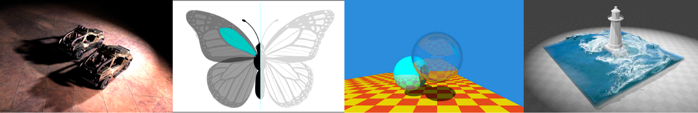

# GAMES101 简介

::: tip 关于
学习[GAMES101: 现代计算机图形学入门](https://sites.cs.ucsb.edu/~lingqi/teaching/games101.html)的笔记

看完就忘，随便记记 🤡

:::

::: info 课程主要内容

- **光栅化**

- **曲线和网格**

- **光线追踪**

- **动画/模拟**

注: 写中英文是因为部分内容不是很清楚翻译的是否正确或是不知道怎么翻译.

借鉴了知乎博主: XiaoWan 的笔记.

:::
