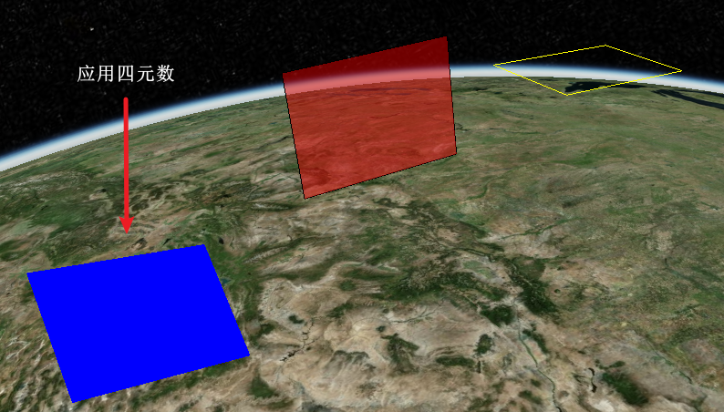
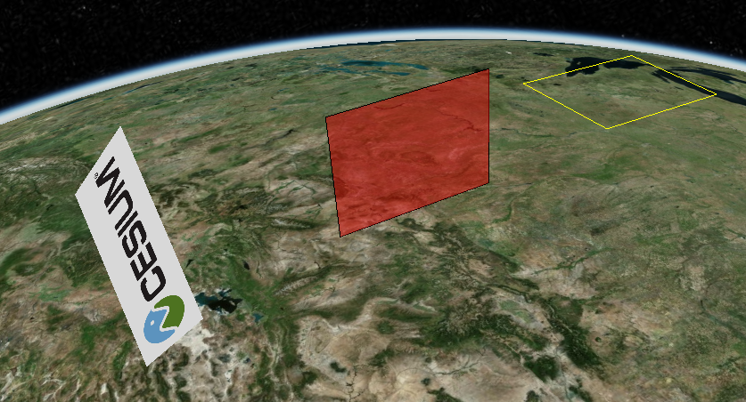

# 3d 文字

## 问题背景

需要在 cesium 场景中加载 3d 文字，发现没有这个接口，手动实现。

|     参数     |                  类型                   |
| :----------: | :-------------------------------------: |
|   文字内容   |        String `示例文字` 字符串         |
|   矩形位置   |   Array `[109, 42, 100]` 经纬度&高程    |
|   矩形大小   | Object `{length: Num, width: Num}` 数组 |
| 矩形旋转信息 |       Array `[0, 0, 0, 1]` 四元数       |

## 思路一

通过渲染自定义的 Plane，然后贴文字纹理来实现，需确认默认的法线方向，然后以此为基准应用四元数确定最终位置

```js
const viewer = new Cesium.Viewer("cesiumContainer");
let a = new Cesium.Cartesian3(1, 1, 0.5); //测试数据
let b = new Cesium.Cartesian3();
Cesium.Cartesian3.normalize(a, b); //自定义法线方向
const bluePlane = viewer.entities.add({
  name: "Blue plane",
  orientation: new Cesium.Quaternion(-0.014949, 0.706949, 0.706949, -0.014949),
  position: Cesium.Cartesian3.fromDegrees(-114.0, 40.0, 405.700312),
  plane: {
    plane: new Cesium.Plane(b, 0),
    // plane: new Cesium.Plane(Cesium.Cartesian3.UNIT_Z, 0), //默认法线方向
    dimensions: new Cesium.Cartesian2(400000.0, 300000.0),
    material: Cesium.Color.BLUE,
    // material:  "../images/Cesium_Logo_Color.jpg", //贴图
  },
});
```





## 思路二 12/13/2024

基于 WebGL 重新实现 3d 文字，`较复杂`

最新思路：

- LabelCollection
- 矩形图元
- 传入坐标与形态
