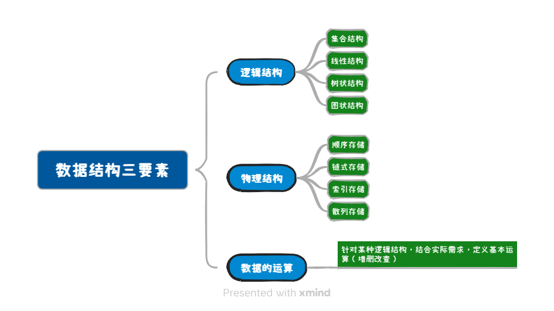

# 数据结构基本概念
:::details 关于

**内容**
- 数据、数据元素、数据项、数据对象、数据结构的定义；
- 数据的逻辑结构、数据的物理结构、数据的运算的定义；
- 数据类型以及抽象数据类型的定义。

**要求**
- 掌握数据、数据元素、数据项之间的关系；
- 掌握数据结构的定义；
- 掌握数据结构的三要素；
- 掌握数据类型、抽象数据类型和数据结构之间的关系。

:::

## 术语定义

| 术语 | 定义 |
| ------------- | :----------- |
| 数据   | **数据**是信息的载体, 是描述客观事物属性的`数、字符及所有能输入到计算机中并被计算机程序识别和处理的符号`的集合. |
| 数据元素 |**数据元素**是**数据**的基本单位, 通常作为一个整体进行考虑和处理|
| 数据项   | 一个**数据元素**可由若干**数据项**组成，**数据项**是构成数据元素的`不可分割的最小单位`. |
| 数据对象   | **数据对象**是具有相同性质的**数据元素**的集合, 是**数据**的一个子集. |
| 数据结构   | 1.**数据结构**是相互之间存在一种或多种特定关系的`数据元素的集合`.  2.**数据结构**这门课着重关注的是**数据元素**之间的`关系`和对这些**数据元素**的`操作`, 而不关心具体的**数据项**内容.|

## 三要素
| 术语 | 定义 |
| ------------- | :----------- |
| 逻辑结构 | 指数据元素之间的逻辑关系. |
| 存储结构 | 指数据结构在计算机中的表示(又称映像), 也称**物理结构**. |
| 运算 | 施加在数据上的运算包括运算的定义和实现. 运算的定义是针对逻辑结构的, 指出运算的功能; 运算的实现是针对存储结构的, 指出运算的具体操作步骤. |

## 数据类型

| 术语 | 定义 |
| ------------- | :----------- |
| 数据类型 | 是一个值的集合和定义在此集合上的一组操作的总称. 1. **原子类型**: 不可再分(int、bool等)   2. **结构类型**: 可再分解(struct等)   3. **抽象数据类型(ADT)**: 是抽象数据组织及其相关的操作, 定义了一个ADT就是在定义一种数据结构. |

