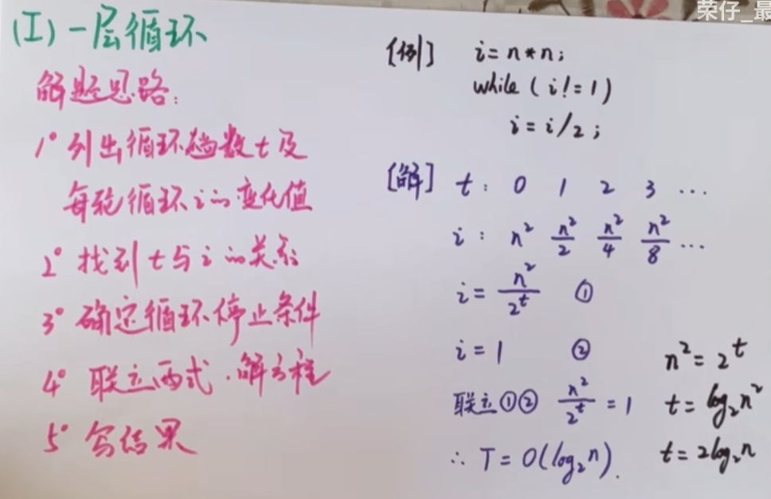
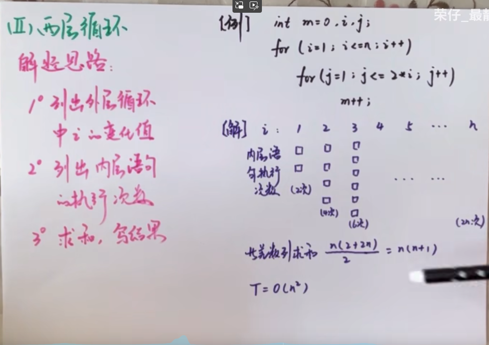
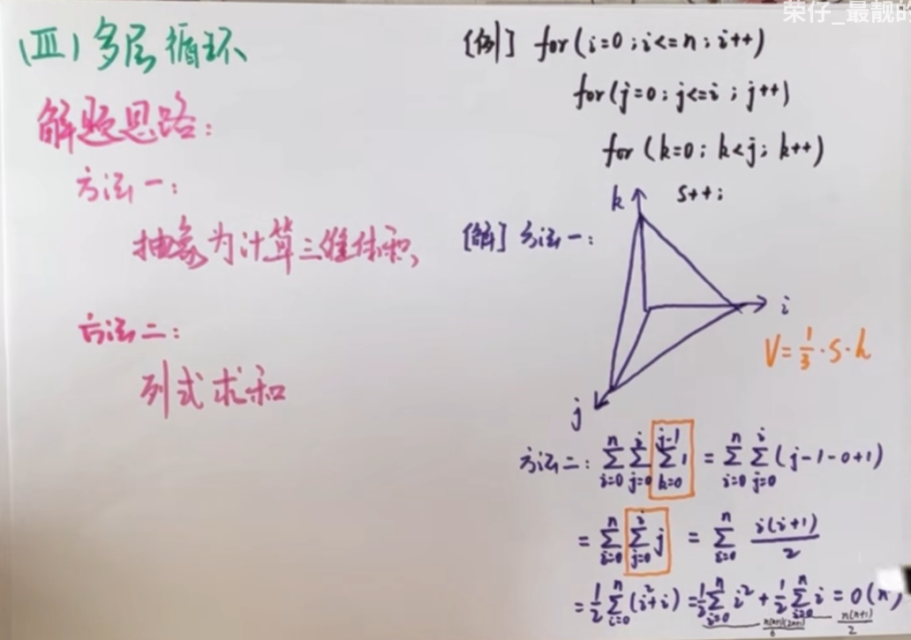

# 算法和算法分析

:::details 关于

**内容**
- 算法的定义、算法的特性、算法的时间复杂度和算法的空间复杂度的定义及计算。

**要求**
- 了解算法的定义以及特性；
- 了解衡量算法在资源上的两个方面；
- 掌握算法的渐进性分析方法，会用该方法对算法进行评估；
- 掌握Ο标记法，理解大Ο标记法的意义；
- 掌握Ω标记法，理解大Ω标记法的意义；
- 掌握Θ标记法，理解大Θ标记法的意义；
- 了解时空权衡原则。
:::
## 算法
### 定义
算法是对`特定问题求解步骤的一种描述`，它是指令的有限序列，其中的每条指令表示一个或多个操作。

### 特性

| 特性 | 解释 |
| ------------- | :----------- |
| **有穷性** | 一个算法必须总在执行有穷步之后结束，且每一步都可在有穷时间内完成。 |
| **确定性** | 算法中每条指令必须有确切的含义，对于相同的输入只能得出相同的输出。 |
| **可行性** | 算法中描述的操作都可以通过已经实现的基本运算执行有限次来实现。 |
| **输入** | 一个算法有零个或多个输入，这些输入取自于某个特定的对象的集合。 |
| **输出** | 一个算法有一个或多个输出，这些输出是与输入有着某种特定关系的量。 |


**"好"算法特征:**
- 正确性 
- 可读性 
- 健壮性 
- 高效率（时间/空间）

## 算法分析

:star: **算法效率的度量是通过时间复杂度和空间复杂度来描述的.**

### 时间复杂度

一个语句的**频度**是指该语句在算法中**被重复执行的次数**. 算法中**所有语句的频度之和**记为**T(n)**, 他是该算法问题规模**n**的函数, **时间复杂度**主要分析**T(n)**的**数量级**. 

算法中**基本运算(最深层循环中的语句)**的**频度**与T(n)同数量级, 因此通常将算法中**基本运算的执行次数的数量级**作为该算法的时间复杂度. 于是, 算法的时间复杂度记为:
$$T(n)=O(f(n))$$
**O**的含义是T(n)的数量级.

:::tip 注
- 最坏时间复杂度
- 平均时间复杂度
- 最好时间复杂度

<font color="#909399">一般总是考虑在最坏情况下的时间复杂度, 以保证算法的运行时间不会比它更长.</font>

在分析一个程序的时间复杂度时, 有以下两天规则:
1. **加法规则:** $T(n)=T_1(n)+T_2(n)=O(f(n))+O(g(n))=O(max(f(n), g(n)))$
2. **乘法规则:** $T(n)=T_1(n)×T_2(n)=O(f(n))×O(g(n))=O(f(n)×g(n))$

``` txt
//例如, 设a{} b{} c{} 三个语句块的时间复杂度分别为O(1) O(n) O(n²), 则
a {
    b {}
    c {}
} //时间复杂度为O(n²), 满足加法规则
---
a {
    b {
        c {}
    }
} //时间复杂度为O(n³), 满足乘法规则
```
**常见的渐近时间复杂度为**

$O(1) < O(logn) < O(n) < O(nlogn) < O(n^2) < O(n^3) < O(2^n) < O(n!) < O(n^n)$

**`logn`是以什么为底数？**

在算法分析中，当我们说时间复杂度是 $O(\log n)$ 时，通常是以 2 为底的对数，即 $\log_2 n$。

这是因为在许多算法中，特别是涉及二分查找、平衡二叉树（如 AVL 树、红黑树）等操作时，操作的次数是根据将问题规模不断减半的原则进行的。例如，在二分查找中，每次操作都将搜索范围缩小为原来的一半，直到找到目标元素或确定元素不存在。

假设我们有一个有序数组 `[1, 2, 3, 4, 5, 6, 7, 8, 9, 10]`，要查找元素 `7`，我们首先看中间元素 `5`，因为 `7 > 5`，所以我们只需要在 `[6, 7, 8, 9, 10]` 这个子数组中继续查找，这个子数组的长度是原数组长度的一半，即 $n/2$。然后我们继续将这个子数组一分为二，不断重复这个过程，直到找到元素或确定元素不存在。每一次操作都会将搜索范围减半，所以查找所需的步骤数就是 $O(\log_2 n)$ 。

在渐近分析中，对数的底数并不影响复杂度的增长趋势，因为不同底数的对数之间只相差一个常数因子。根据换底公式：$\log_a n=\frac{\log_b n}{\log_b a}$，对于任何大于 1 的底数 $a$ 和 $b$，不同底数的对数函数之间只是一个常数倍的关系，在大 O 表示法中，常数因子会被忽略，所以我们通常用 $O(\log n)$ 来简洁表示对数时间复杂度，而不明确指出底数。

例如，$\log_2 n=\frac{\log_{10} n}{\log_{10} 2}$，其中 $\log_{10} 2$ 是一个常数，因此 $\log_2 n$ 和 $\log_{10} n$ 在渐近意义上是等价的，它们的增长速度相同，只是相差一个常数因子。


总之，在算法的时间复杂度分析中，$O(\log n)$ 一般是指以 2 为底的对数，但由于不同底数的对数函数仅相差一个常数因子，在大 O 表示法中可以不明确指出底数，它们的增长趋势是相同的。
:::


### 空间复杂度

#### 定义
该算法所需的存储空间, 它时问题规模**n**的函数, 记为$S(n)=O(g(n))$


## 时间复杂度计算方法

### one
来自：[哔哩哔哩](https://www.bilibili.com/video/BV13d4y1K74p/?spm_id_from=333.337.search-card.all.click&vd_source=ab7db153cb3c1a5fcc8ca921f92378b7)

**单层循环：**


**双层循环：**


**多层循环：**


### two
while / for 
