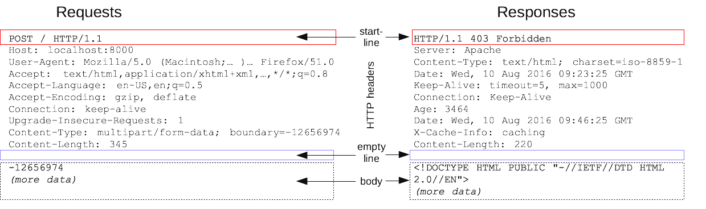

# Http概述

# Http消息

HTTP 请求和响应具有相似的结构，由以下部分组成：

1. 一行起始行用于描述要执行的请求，或者是对应的状态，成功或失败。这个起始行总是单行的。
2. 一个可选的 HTTP 标头集合指明请求或描述消息主体（body）。
3. 一个空行指示所有关于请求的元数据已经发送完毕。
4. 一个可选的包含请求相关数据的主体（比如 HTML 表单内容），或者响应相关的文档。主体的大小有起始行的 HTTP 头来指定。

起始行和 HTTP 消息中的 HTTP 头统称为请求头，而其有效负载被称为消息主体。

