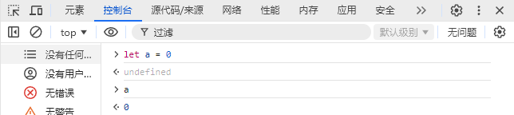
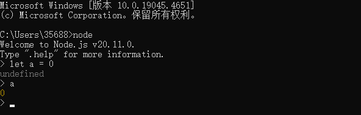

# Node.js

:::tip 关于 Node.js
官方定义: Node.js® 是一个免费、开源、跨平台的 JavaScript **运行时环境**，它让开发人员能够创建服务器、Web 应用、命令行工具和脚本。

:::

**发现了个nodejs笔记的开源项目，这页留着记录真实开发时遇到的问题就行了**

https://nqdeng.github.io/7-days-nodejs/
