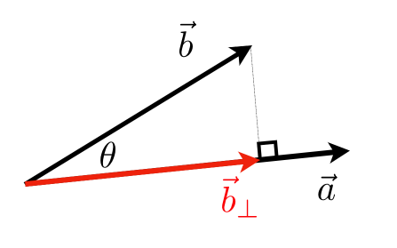
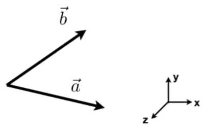
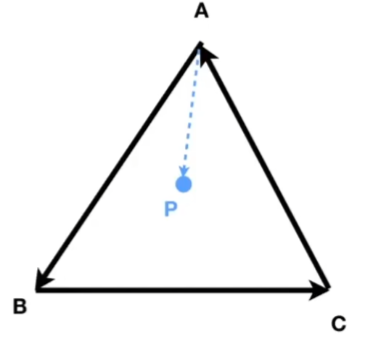

# 线性代数

### 向量(Vector)
::: info 基础
- 方向
- 长度
- 单位向量
  $$\widehat{a} = \frac {\vec{a}} {\lVert \vec{a} \rVert}\$$
- 求和
:::

::: info 点乘
- 算夹角：
  $$\vec{a} \cdot \vec{b} = \lVert \vec{a} \rVert \lVert \vec{b} \rVert \cos\theta  $$
- 对单位向量：
  $$\cos\theta = \widehat{a} \cdot \widehat{b} $$
- In 2D：
  $$\vec{a} \cdot \vec{b} = \begin{pmatrix} x_a \\\\ y_a \\\\ \end{pmatrix} \cdot \begin{pmatrix} x_b \\\\ y_b \\\\ \end{pmatrix} = x_a x_b + y_a y_b$$
- In 3D：
  $$\ldots$$
- 投影：
  $$\vec{b_\bot} = k \widehat{a}$$
  $$k = \lVert \vec{b_\bot} \rVert = \lVert \vec{b} \rVert \cos\theta$$
  

- 判断方向性： 基本相同/反
:::

::: info 叉乘

- 叉乘得到一个垂直于平面 $\vec{x} \times \vec{y} = +\vec{z}$ 的向量，是右手坐标系 
  
- 不满足交换律

- 判断左右：
  
  
- 判断内外：
  
:::
   

### 矩阵(matrix)
::: info 矩阵运算
- 运算法则
  $$ (AB)C = A(BC)  $$
  $$ A(B+C) = AB+AC  $$
  $$ (A+B)C = AC+BC  $$

- 向量乘积(· ×)可以写成矩阵形式
:::
