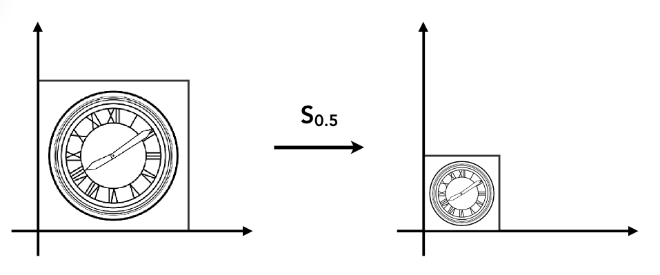
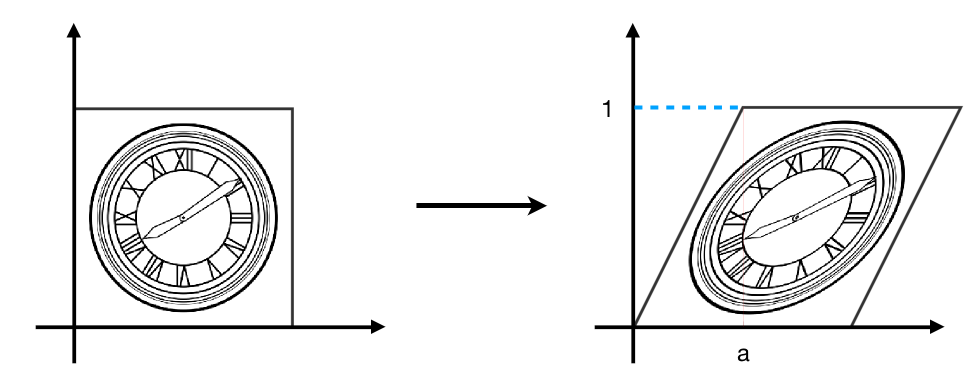
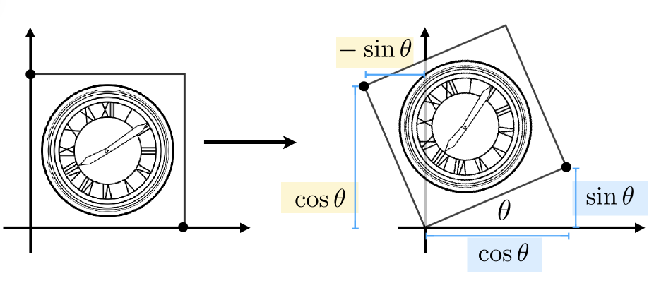
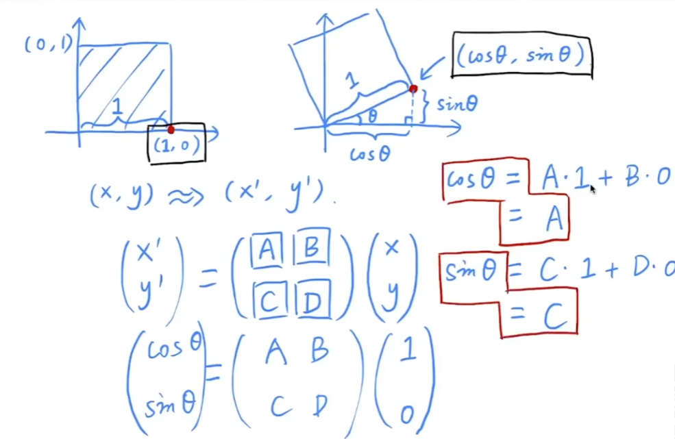
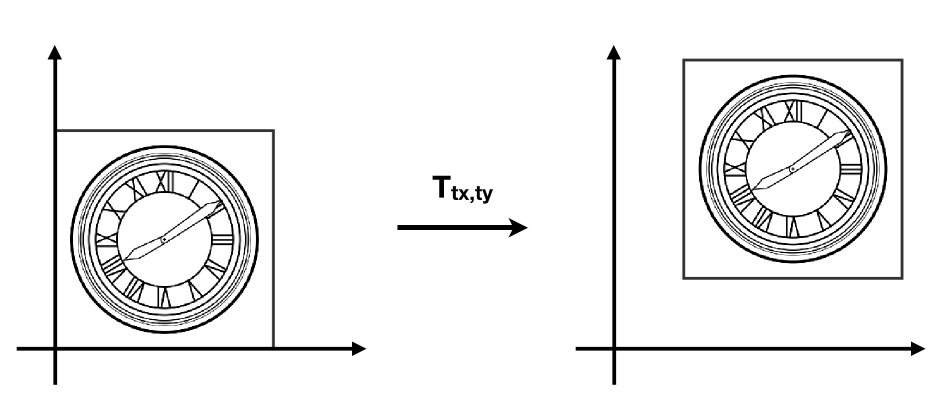
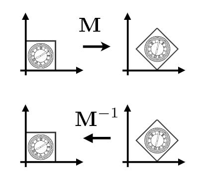
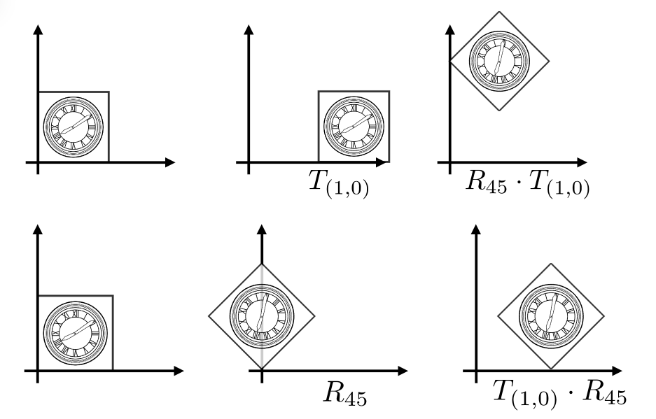

# 变换

## 模型变换

::: info 01.

**缩放**

$$ \begin{bmatrix} x' \\\\ y' \\\\ \end{bmatrix} = \begin{bmatrix} s_x & 0 \\\\ 0 & s_y \\\\ \end{bmatrix} \begin{bmatrix} x \\\\ y \\\\ \end{bmatrix}$$

**切变**

$$ \begin{bmatrix} x' \\\\ y' \\\\ \end{bmatrix} = \begin{bmatrix} 1 & a \\\\ 0 & 1 \\\\ \end{bmatrix} \begin{bmatrix} x \\\\ y \\\\ \end{bmatrix}$$

:::
::: tip 02.
**旋转**

$$ R\_\theta = \begin{bmatrix} \cos\theta & -\sin\theta \\\\ \sin\theta & \cos\theta \\\\ \end{bmatrix} $$

推导：

:::
::: info 03.
**线性变换(Linear Transforms)**

$$ x' = ax + by $$
$$ y' = cx + dy $$
$$ \begin{bmatrix} x' \\\\ y' \\\\ \end{bmatrix} = \begin{bmatrix} a & b \\\\ c & d \\\\ \end{bmatrix}\begin{bmatrix} x \\\\ y \\\\ \end{bmatrix} $$
$$ x' = Mx $$

**齐次坐标**

平移变换的特殊性：平移变换不是线性变换，想统一处理所以引入齐次坐标。

$$ x' = x+t_x $$
$$ y' = y+t_y $$
$$ \begin{bmatrix} x' \\\\ y' \\\\ \end{bmatrix} = \begin{bmatrix} a & b \\\\ c & d \\\\ \end{bmatrix}\begin{bmatrix} x \\\\ y \\\\ \end{bmatrix} + \begin{bmatrix} t_x \\\\ t_y \\\\ \end{bmatrix} $$

特殊性：平移变换不是线性变换，想统一处理所以引入齐次坐标。

方法：增加一个维度。

- $$ 2D: point = (x, y, 1)^T $$ 
- $$ 2D: vector = (x, y, 0)^T $$ 

`注：向量具有平移不变性，所以此处 1 0 `

平移的矩阵表示：
$$ \begin{pmatrix} x' \\\\ y' \\\\ w' \\\\ \end{pmatrix} = \begin{pmatrix} 1 & 0 & t_x \\\\ 0 & 1 & t_y \\\\ 0 & 0 & 1 \\\\ \end{pmatrix} \cdot \begin{pmatrix} x \\\\ y \\\\ 1 \\\\ \end{pmatrix} = \begin{pmatrix} x+t_x \\\\ y+t_y \\\\ 1 \\\\ \end{pmatrix} $$

$$ \begin{pmatrix} x \\\\ y \\\\ w \\\\ \end{pmatrix} is the 2D point \begin{pmatrix} x/w \\\\ y/w \\\\ 1 \\\\ \end{pmatrix} $$

:::

::: tip 仿射变换
#### 仿射变换

`仿射变换 = 线性变换 + 平移变换`

$$ \begin{pmatrix} x' \\\\ y' \\\\ \end{pmatrix} = \begin{pmatrix} a & b \\\\ c & d \\\\ \end{pmatrix} \cdot \begin{pmatrix} x \\\\ y \\\\ \end{pmatrix} + \begin{pmatrix} t_x \\\\ t_y \\\\ \end{pmatrix} $$

使用齐次坐标

$$ \begin{pmatrix} x' \\\\ y' \\\\ 1 \\\\ \end{pmatrix} = \begin{pmatrix} a & b & t_x \\\\ c & d & t_y \\\\ 0 & 0 & 1 \\\\ \end{pmatrix} \cdot \begin{pmatrix} x \\\\ y \\\\ 1 \\\\ \end{pmatrix} $$
:::
::: info 2D转换
#### 2D转换

- 缩放 
 $$ S(s_x, s_y) = \begin{pmatrix} s_x & 0 & 0 \\\\ 0 & s_y & 0  \\\\ 0 & 0 & 1 \\\\ \end{pmatrix} $$
- 旋转 
 $$ R(\alpha) = \begin{pmatrix} \cos\alpha & -\sin\alpha & 0 \\\\ \sin\alpha & \cos\alpha & 0  \\\\ 0 & 0 & 1 \\\\ \end{pmatrix} $$
- 平移 
 $$ T(t_x, t_y) = \begin{pmatrix} 1 & 0 & t_x \\\\ 0 & 1 & t_y  \\\\ 0 & 0 & 1 \\\\ \end{pmatrix} $$
:::
::: tip 逆变换
#### 逆变换

 $$ M^{-1} $$

:::
::: info 复合变换
#### 复合变换

先平移后旋转 与 先旋转后平移

矩阵乘法不满足交换律

$$ R_{45} \cdot T_{(1, 0)} \neq T_{(1, 0)} \cdot R_{45} $$

注意，矩阵是从右向左应用的

$$ T_{(1, 0)} \cdot R_{45} \begin{bmatrix} x \\\\ y \\\\ 1 \\\\ \end{bmatrix} = \begin{bmatrix} 1 & 0 & 1 \\\\ 0 & 1 & 1  \\\\  0 & 0 & 1 \\\\ \end{bmatrix}\begin{bmatrix} \cos\alpha & -\sin\alpha & 0 \\\\ \sin\alpha & \cos\alpha & 0  \\\\ 0 & 0 & 1 \\\\ \end{bmatrix} \begin{bmatrix} x \\\\ y \\\\ 1 \\\\ \end{bmatrix} $$
:::

## 视图变换
