# Transformation Cont

`对应GAMES101 Lecture 04`

## 3D transformations[上一节]

### 3D变换

::: info 缩放(Scale)

$$ S(s_x, s_y, s_z) = \begin{pmatrix} s_x & 0 & 0 & 0 \\\\ 0 & s_y & 0 & 0 \\\\ 0 & 0 & s_z & 0 \\\\ 0 & 0 & 0 & 1 \end{pmatrix} $$

:::
::: info 平移(Translation)

$$ T(t_x, t_y, t_z) = \begin{pmatrix} 1 & 0 & 0 & t_x \\\\ 0 & 1 & 0 & t_y \\\\ 0 & 0 & 1 & t_z \\\\ 0 & 0 & 0 & 1 \end{pmatrix} $$

:::
::: info 旋转绕轴[Rotation around x-, y-, or z-axis]

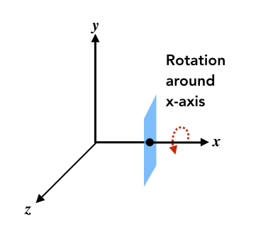

$$ R_x(\alpha) = \begin{pmatrix} 1 & 0 & 0 & 0 \\\\ 0 & \cos\alpha & -\sin\alpha & 0 \\\\ 0 & \sin\alpha & \cos\alpha & 0 \\\\ 0 & 0 & 0 & 1 \end{pmatrix} $$
$$ R_y(\alpha) = \begin{pmatrix} \cos\alpha & 0 & \sin\alpha & 0 \\\\ 0 & 1 & 0 & 0 \\\\ -\sin\alpha & 0 & \cos\alpha & 0 \\\\ 0 & 0 & 0 & 1 \end{pmatrix} $$
$$ R_z(\alpha) = \begin{pmatrix} \cos\alpha & -\sin\alpha & 0 & 0 \\\\ \sin\alpha & \cos\alpha & 0 & 0 \\\\ 0 & 0 & 1 & 0 \\\\ 0 & 0 & 0 & 1 \end{pmatrix} $$

:::

### 3D Rotations

Compose any 3D rotation from $R_x, R_y, R_z$ ?

$$ R_{xyz}(\alpha, \beta, \gamma) = R_x(\alpha)R_y(\beta)R_z(\gamma) $$

- 欧拉角 (So-called Euler angles) 
- 常用于飞行模拟器:滚转，俯仰，偏航 (Often used in flight simulators: roll, pitch, yaw)
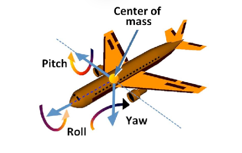

### Rodrigues’ Rotation Formula

Rotation by angle α around axis n

$$ R(n, \alpha) = \cos(\alpha)I + (1- \cos(\alpha))nn^T + \sin(\alpha)\underbrace{\begin{pmatrix} 0 & -n_z & n_y \\\\ n_z & 1 & -n_x \\\\ -n_y & n_x & 0 \end{pmatrix}}_{N} $$

证明：
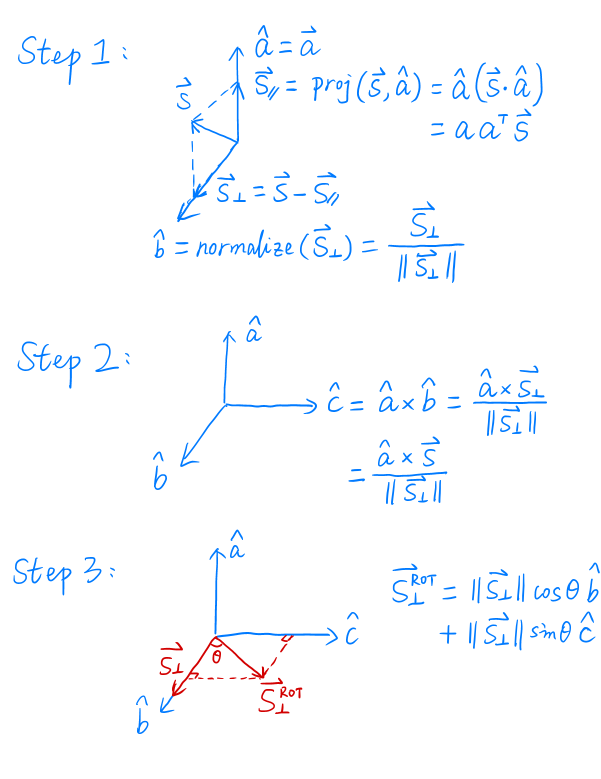

## Viewing(观测) transformation

- View(视图)/Camera transformation
- Projection(投影) transformation
    - Orthographic(正交) projection
    - Perspective(透视) projection

### 视图/相机变换 (View/Camera transformation)

- 什么是观测变换? (What is view transformation?)

- 怎么实现? (How to perform view transformation?)

- 首先定义相机 (Define the camera first)
    - 位置 (Position) $\vec{e}$
    - 朝向 (Look-at / gaze direction) $\vec{g}$
    - 上方向(假设垂直于朝向) (Up direction(assuming perp. to look-at)) $\vec{t}$

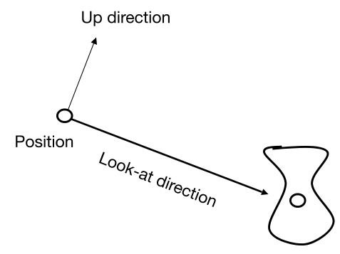

- 关键 (Key observation)
    - 同时变换相对不变 (If the camera and all objects move together, the “photo” will be the same)

- 约定 (How about that we always transform the camera to)
    - 位于原点, Up在Y轴, 看向-Z轴 (The origin, up at Y, look at -Z)
    - 和相机一起变换物体 (And transform the objects along with the camera)

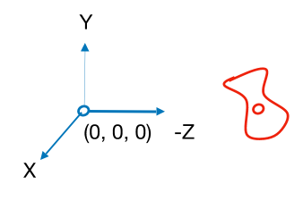

- 变换相机通过矩阵M (Transform the camera by $M_{view}$)
    - 位于原点，在Y上，看-Z (So it’s located at the origin, up at Y, look at -Z )

- 数学上矩阵M ($M_{view}$ in math?)
    - 移动e到原点 (Translates e to origin)
    - 旋转g到-Z (Rotates g to -Z) 
    - 旋转t到Y (Rotates t to Y) 
    - 旋转(g叉乘t)到X (Rotates (g x t) To X)

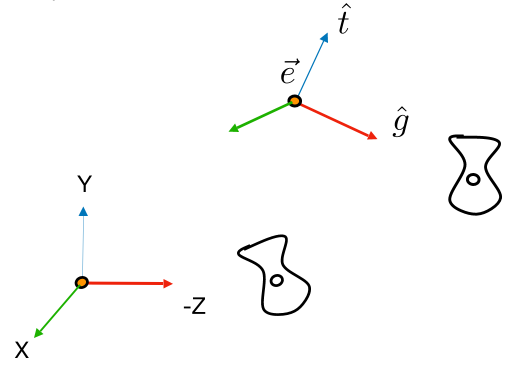

- 求最终矩阵
    - $M_{view} = R_{view}T_{view}$
    - 步骤一 (Translate e to origin)
        $$ T_{view} = \begin{bmatrix} 1&0&0&-x_e \\\\ 0&1&0&-x_y \\\\ 0&0&1&-x_z \\\\ 0&0&0&1 \\\\ \end{bmatrix} $$
    - 步骤二 (Rotate g to -Z, t to Y, (g x t) To X)
    - 考虑逆旋转 (Consider its inverse rotation: X to (g x t), Y to t, Z to -g)
        $$ R_{view}^{-1} = \begin{bmatrix} x_{\hat{g}\times\hat{t}}&x_t&x_{-g}&0 \\\\ y_{\hat{g}\times\hat{t}}&y_t&y_{-g}&0 \\\\ z_{\hat{g}\times\hat{t}}&z_t&z_{-g}&0 \\\\ 0&0&0&1 \\\\ \end{bmatrix} $$
        WHY? //TODO
        $$ R_{view} = \begin{bmatrix} x_{\hat{g}\times\hat{t}}&y_{\hat{g}\times\hat{t}}&z_{\hat{g}\times\hat{t}}&0 \\\\ x_t&y_t&z_t&0 \\\\ x_{-g}&y_{-g}&z_{-g}&0 \\\\ 0&0&0&1 \\\\ \end{bmatrix} $$
- 总结
    - 与相机一起变换物体 (Transform objects together with the camera)
    - 直到相机在原点，在Y上，看-Z (Until camera’s at the origin, up at Y, look at -Z)

### 投影变换 (Projection Transformation)

- 计算机图形学中的投影 (Projection in Computer Graphics)
    - 3D to 2D
    - 正交投影 (Orthographic projection)
    - 透视投影 (Perspective projection)

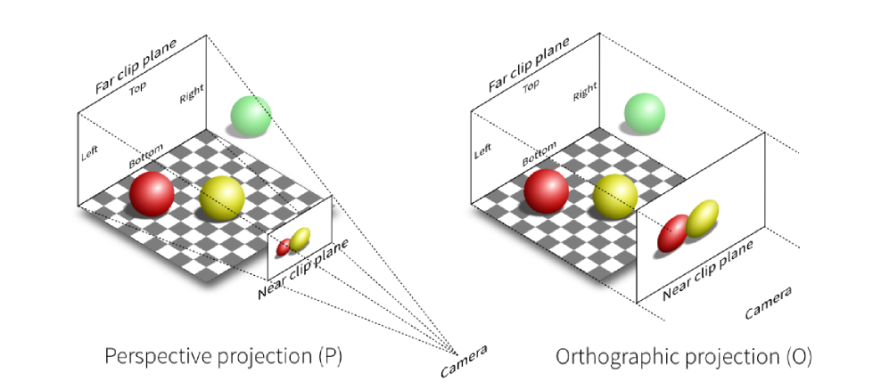

#### 正交投影 (Orthographic Projection)

::: info 简单理解
- 相机位于原点，看着-Z，向上看Y
- 去掉Z轴
- 将得到的矩形平移并缩放为[- 1,1]² (Translate and scale the resulting rectangle to [-1, 1]²)
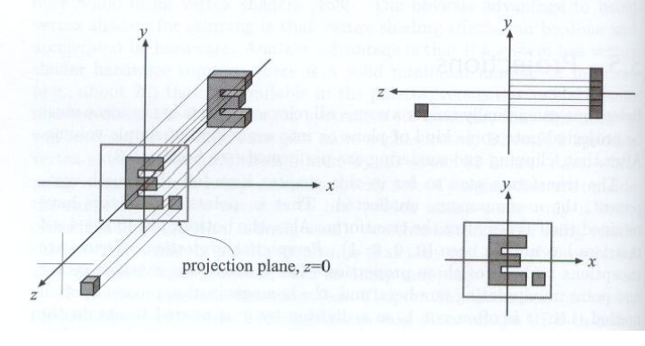
:::
::: tip 通常来说 (In general)

- We want to map a cuboid [l, r] x [b, t] x [f, n] to the “canonical (正则、规范、标准)” cube [-1, 1]³
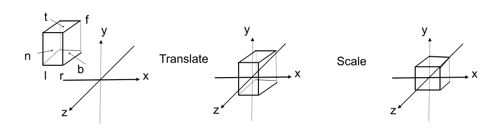
:::

::: info Slightly different orders (to the “simple way”)
- Center cuboid by translating 
- Scale into “canonical” cube
:::

::: tip 平移矩阵(Transformation matrix)
- Translate (center to origin) first, then scale (length/width/height to 2)
$$ M_{ortho} = \begin{bmatrix} \frac{2}{r-l} & 0 & 0 & 0 \\\\ 0 & \frac{2}{t-b} & 0 & 0 \\\\ 0 & 0 & \frac{2}{n-f} & 0 \\\\ 0 & 0 & 0 & 1 \end{bmatrix}\begin{bmatrix} 1 & 0 & 0 & -\frac{r+l}{2} \\\\ 0 & 1 & 0 & -\frac{t+b}{2} \\\\ 0 & 0 & 1 & -\frac{n+f}{2} \\\\ 0 & 0 & 0 & 1 \end{bmatrix} $$
:::

::: info Caveat
- Looking at / along -Z is making near and far not intuitive (n > f)
- FYI: that’s why OpenGL (a Graphics API) uses left hand coords
:::

#### 透视投影 (Perspective Projection)

::: tip 最常见于计算机图形学、美术、视觉系统, 进大远小, 更符合人眼观测

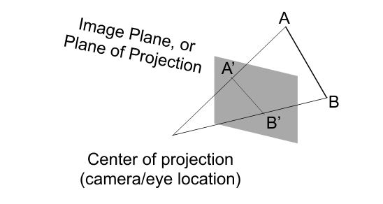

:::

::: info 开始之前, 回想一下齐次坐标的性质
- (x, y, z, 1), (kx, ky, kz, k != 0), (xz, yz, z², z != 0) all represent the same point (x, y, z) in 3D 
- e.g. (1, 0, 0, 1) and (2, 0, 0, 2) both represent (1, 0, 0) 
:::

::: tip 怎么做(How to do perspective projection)
- 首先把截锥体压成一个长方体 (First “squish” the frustum into a cuboid[n->n, f->f][$M_{persp \rightarrow ortho}$])
- 做正交投影 (Do orthographic projection[$M_{ortho}$, already known!])

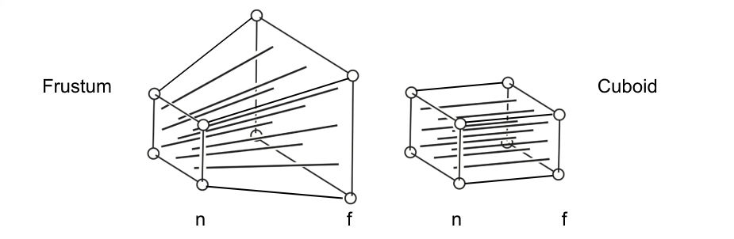

:::

::: info 找对应点之间的关系
Find the relationship between transformed points (x’, y’, z’) and the original points (x, y, z)
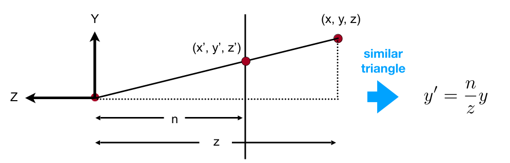

- 齐次坐标系下 (In homogeneous coordinates)
$$ \begin{pmatrix} x \\\\ y \\\\ z \\\\ 1 \end{pmatrix} \Rightarrow \begin{pmatrix} nx/z \\\\ ny/z \\\\ unknown \\\\ 1 \end{pmatrix} == \begin{pmatrix} nx \\\\ ny \\\\ still unknown \\\\ z \end{pmatrix}$$

- So the “squish” (persp to ortho) projection does this
$$ M_{persp \rightarrow ortho}^{4\times4}\begin{pmatrix} x \\\\ y \\\\ z \\\\ 1 \end{pmatrix} = \begin{pmatrix} nx \\\\ ny \\\\ unknown \\\\ z  \end{pmatrix} $$

- Already good enough to figure out part of $M_{persp \rightarrow ortho}$
$$ M_{persp \rightarrow ortho} = \begin{pmatrix} n&0&0&0 \\\\ 0&n&0&0 \\\\ ?&?&?&? \\\\ 0&0&1&0 \end{pmatrix} $$

- 求第三行 
    - Observation: the third row is responsible for z’
    - Any point on the near plane will not change
    - Any point’s z on the far plane will not change
    $$ M_{persp \rightarrow ortho}^{4\times4}\begin{pmatrix} x \\\\ y \\\\ z \\\\ 1 \end{pmatrix} = \begin{pmatrix} nx \\\\ ny \\\\ unknown \\\\ z  \end{pmatrix} \underrightarrow{replace-z-with-n} \begin{pmatrix} x \\\\ y \\\\ z \\\\ 1 \end{pmatrix} \Rightarrow \begin{pmatrix} x \\\\ y \\\\ z \\\\ 1 \end{pmatrix} == \begin{pmatrix} nx \\\\ ny \\\\ n^2 \\\\ n \end{pmatrix} $$
    - So the third row must be of the form (0 0 A B)
    $$ \begin{pmatrix} 0&0&A&B \end{pmatrix}\begin{pmatrix} x \\\\ y \\\\ n \\\\ 1 \end{pmatrix} = n^2 $$
    $$ An+B = n^2 $$
    $$ \begin{pmatrix} 0 \\\\ 0 \\\\ f \\\\ 1 \end{pmatrix} \Rightarrow \begin{pmatrix} 0 \\\\ 0 \\\\ f \\\\ 1 \end{pmatrix} == \begin{pmatrix} 0 \\\\ 0 \\\\ f^2 \\\\ f \end{pmatrix} $$
    $$ Af + B = f^2 $$
    $$ A = n+f  $$
    $$ B = -nf  $$
    - 最后再做一次正交投影
    $$ M_{persp} = M_{ortho}M_{persp \rightarrow ortho}  $$

:::

