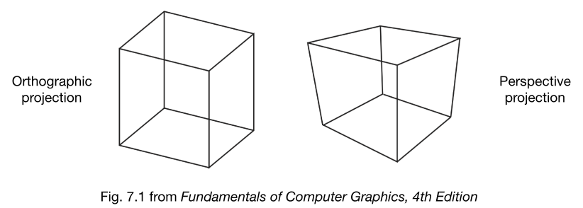

# Transformation Cont

`对应GAMES101 Lecture 04`

## 3D transformations[上一节]

### 3D变换

::: info 缩放(Scale)

$$ S(s_x, s_y, s_z) = \begin{pmatrix} s_x & 0 & 0 & 0 \\\\ 0 & s_y & 0 & 0 \\\\ 0 & 0 & s_z & 0 \\\\ 0 & 0 & 0 & 1 \end{pmatrix} $$

:::
::: info 平移(Translation)

$$ T(t_x, t_y, t_z) = \begin{pmatrix} 1 & 0 & 0 & t_x \\\\ 0 & 1 & 0 & t_y \\\\ 0 & 0 & 1 & t_z \\\\ 0 & 0 & 0 & 1 \end{pmatrix} $$

:::
::: info 旋转绕轴[Rotation around x-, y-, or z-axis]

$$ R_x(\alpha) = \begin{pmatrix} 1 & 0 & 0 & 0 \\\\ 0 & \cos\alpha & -\sin\alpha & 0 \\\\ 0 & \sin\alpha & \cos\alpha & 0 \\\\ 0 & 0 & 0 & 1 \end{pmatrix} $$
$$ R_y(\alpha) = \begin{pmatrix} \cos\alpha & 0 & \sin\alpha & 0 \\\\ 0 & 1 & 0 & 0 \\\\ -\sin\alpha & 0 & \cos\alpha & 0 \\\\ 0 & 0 & 0 & 1 \end{pmatrix} $$
$$ R_z(\alpha) = \begin{pmatrix} \cos\alpha & -\sin\alpha & 0 & 0 \\\\ \sin\alpha & \cos\alpha & 0 & 0 \\\\ 0 & 0 & 1 & 0 \\\\ 0 & 0 & 0 & 1 \end{pmatrix} $$

:::

### 3D Rotations

Compose any 3D rotation from $R_x, R_y, R_z$ ?

$$ R_{xyz}(\alpha, \beta, \gamma) = R_x(\alpha)R_y(\beta)R_z(\gamma) $$

- 欧拉角 (So-called Euler angles) 
- 常用于飞行模拟器:滚转，俯仰，偏航 (Often used in flight simulators: roll, pitch, yaw)

### Rodrigues’ Rotation Formula

Rotation by angle α around axis n

$$ R(n, \alpha) = \cos(\alpha)I + (1- \cos(\alpha))nn^T + \sin(\alpha)\underbrace{\begin{pmatrix} 0 & -n_z & n_y \\\\ n_z & 1 & -n_x \\\\ -n_y & n_x & 0 \end{pmatrix}}_{N} $$

证明：

## Viewing(观测) transformation

- View(视图)/Camera transformation
- Projection(投影) transformation
    - Orthographic(正交) projection
    - Perspective(透视) projection

### 视图/相机变换 (View/Camera transformation)

//TODO
- 什么是观测变换? (What is view transformation?)

- 怎么实现? (How to perform view transformation?)

- 首先定义相机 (Define the camera first)
    - 位置 (Position) $\vec{e}$
    - 朝向 (Look-at / gaze direction) $\vec{g}$
    - 上方向(假设垂直于朝向) (Up direction(assuming perp. to look-at)) $\vec{t}$

- 关键 (Key observation)
    - 同时变换相对不变 (If the camera and all objects move together, the “photo” will be the same)

- 约定 (How about that we always transform the camera to)
    - 位于原点, Up在Y轴, 看向-Z轴 (The origin, up at Y, look at -Z)
    - 和相机一起变换物体 (And transform the objects along with the camera)

- 变换相机通过矩阵M (Transform the camera by $M_{view}$)
    - 位于原点，在Y上，看-Z (So it’s located at the origin, up at Y, look at -Z )

- 数学上矩阵M ($M_{view}$ in math?)
    - 移动e到原点 (Translates e to origin)
    - 旋转g到-Z (Rotates g to -Z) 
    - 旋转t到Y (Rotates t to Y) 
    - 旋转(g叉乘t)到X (Rotates (g x t) To X)

- 求最终矩阵
    - $M_{view} = R_{view}T_{view}$
    - 步骤一 (Translate e to origin)
        $$ T_{view} = \begin{bmatrix} 1&0&0&-x_e \\\\ 0&1&0&-x_y \\\\ 0&0&1&-x_z \\\\ 0&0&0&1 \\\\ \end{bmatrix} $$
    - 步骤二 (Rotate g to -Z, t to Y, (g x t) To X)
    - 考虑逆旋转 (Consider its inverse rotation: X to (g x t), Y to t, Z to -g)
        $$ R_{view}^{-1} = \begin{bmatrix} x_{\hat{g}\times\hat{t}}&x_t&x_{-g}&0 \\\\ y_{\hat{g}\times\hat{t}}&y_t&y_{-g}&0 \\\\ z_{\hat{g}\times\hat{t}}&z_t&z_{-g}&0 \\\\ 0&0&0&1 \\\\ \end{bmatrix} $$
        WHY? //TODO
        $$ R_{view} = \begin{bmatrix} x_{\hat{g}\times\hat{t}}&y_{\hat{g}\times\hat{t}}&z_{\hat{g}\times\hat{t}}&0 \\\\ x_t&y_t&z_t&0 \\\\ x_{-g}&y_{-g}&z_{-g}&0 \\\\ 0&0&0&1 \\\\ \end{bmatrix} $$
- 总结
    - 与相机一起变换物体 (Transform objects together with the camera)
    - 直到相机在原点，在Y上，看-Z (Until camera’s at the origin, up at Y, look at -Z)

### 投影变换 (Projection Transformation)

- 计算机图形学中的投影 (Projection in Computer Graphics)
    - 3D to 2D
    - 正交投影 (Orthographic projection)
    - 透视投影 (Perspective projection)

#### 正交投影 (Orthographic Projection)

#### 透视投影 (Perspective Projection)

