# 光栅化(Rasterization)

## What’s after MVP?
:::info What’s after MVP?
- Model transformation (placing objects)
- View transformation (placing camera)
- Projection transformation
    - Orthographic projection
    - Perspective projection
:::

## Canonical Cube to Screen(规范到屏幕)
:::tip Canonical Cube to Screen(规范到屏幕)
- What is a screen?
    - An array of pixels
    - Size of the array: resolution
    - A typical kind of raster display
- Raster == screen in German
    - Rasterize == drawing onto the screen  
- Pixel (FYI, short for “picture element”)
    - For now: A pixel is a little square with uniform color 
    - Color is a mixture of (<font color="#ff0000">red</font>, <font color="#00ff00">green</font>, <font color="#0000ff">blue</font>)
- Defining the screen space
    - Pixels’ indices are in the form of (x, y), where both x and y are integers
    - Pixels’ indices are from (0, 0) to (width - 1, height - 1)
    - Pixel (x, y) is centered at (x + 0.5, y + 0.5)
    - The screen covers range (0, 0) to (width, height)
    - Irrelevant to z (与Z轴无关)
    - Transform in xy plane: [-1, 1]² to [0, width] x [0, height]
     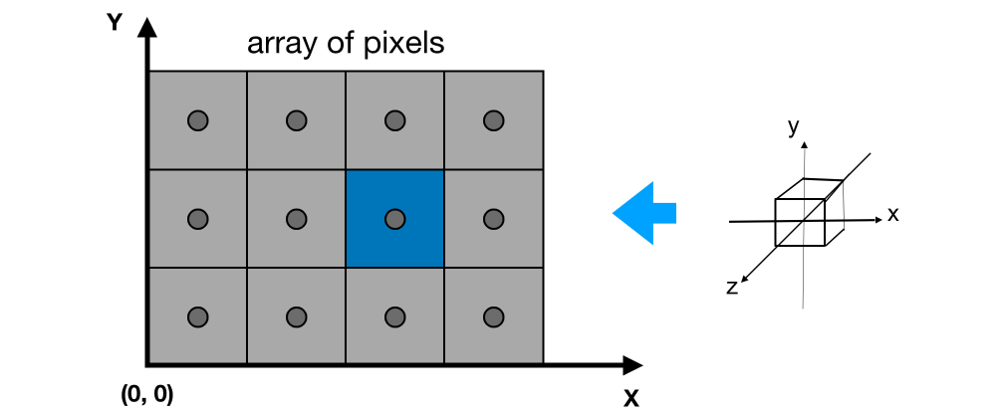
    - Viewport transform matrix:
    $$ M_{viewport} = \begin{pmatrix} \frac{width}{2} & 0 & 0 & \frac{width}{2} \\\\ 0 & \frac{height}{2} & 0 & \frac{height}{2} \\\\ 0 & 0 & 1 & 0 \\\\ 0 & 0 & 0 & 1 \end{pmatrix} $$
:::

## Rasterizing Triangles into Pixels
:::info Rasterizing Triangles into Pixels

**Polygon Meshes**
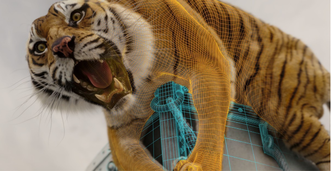

**Triangle Meshes**
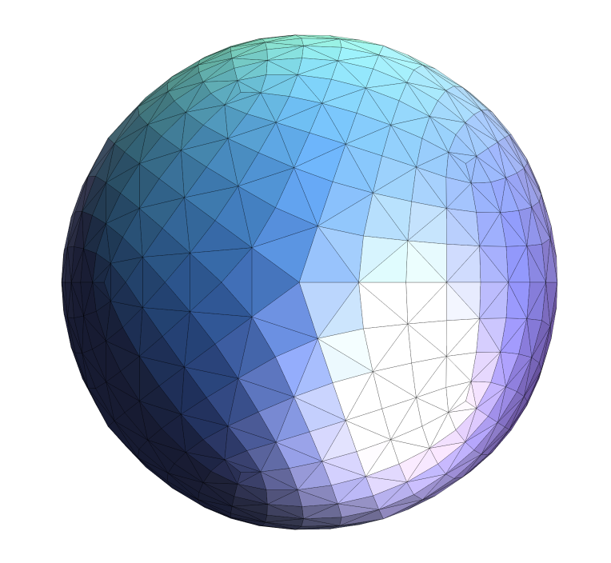
:::

## Triangles - Fundamental Shape Primitives
:::tip Why triangles? 
- Most basic polygon
    - Break up other polygons
- Unique properties
    - Guaranteed to be planar[保证是平面的]
    - Well-defined interior[内部]
    - Well-defined method for interpolating values at vertices over triangle (barycentric interpolation)[三角形顶点插值方法(质心插值)]
:::
:::info What Pixel Values Approximate a Triangle?

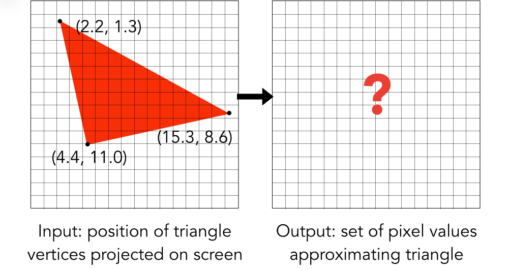

:::

### A Simple Approach: Sampling (一个简单的方法:采样)

Sampling a Function

Evaluating a function at a point is sampling. 

We can discretize a function by sampling. 
``` txt
for (int x = 0; x <  xmax; ++x)
    output[x] = f(x);
```
Sampling is a core idea in graphics. 

We sample time (1D), area (2D), direction (2D), volume (3D) …

### Rasterization As 2D Sampling
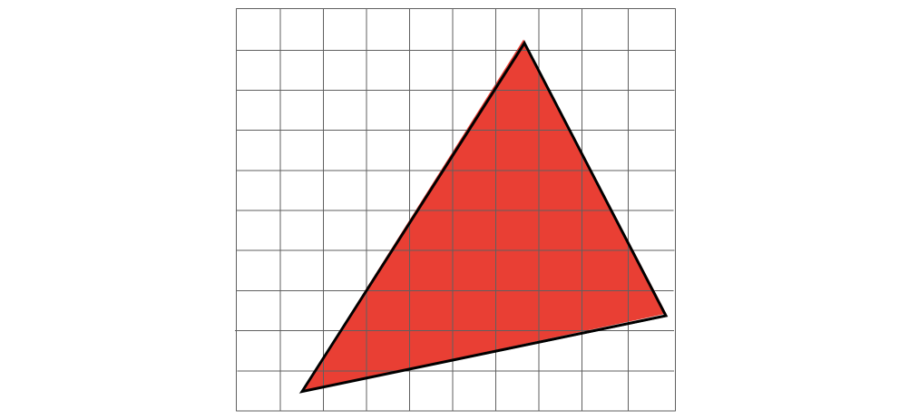

Sample If Each Pixel Center Is Inside Triangle

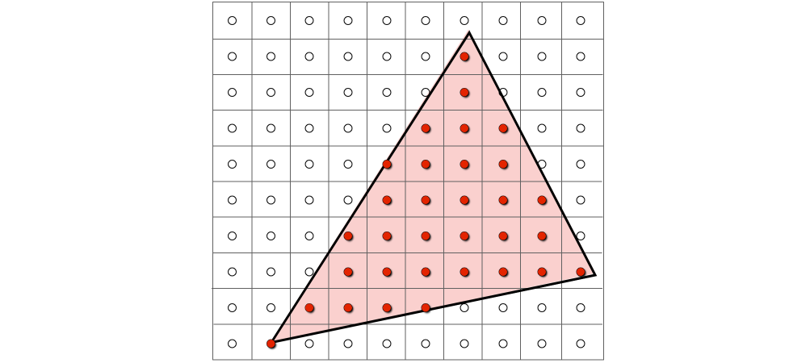

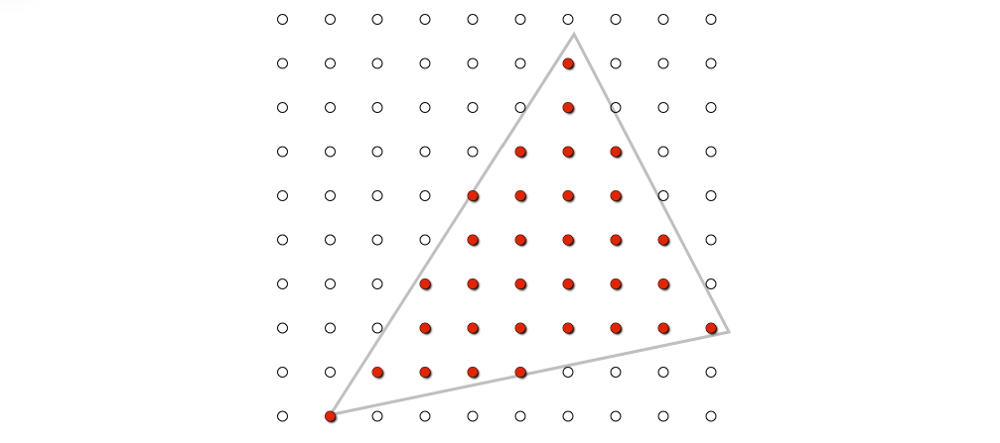

Define Binary Function: inside(tri, x, y)
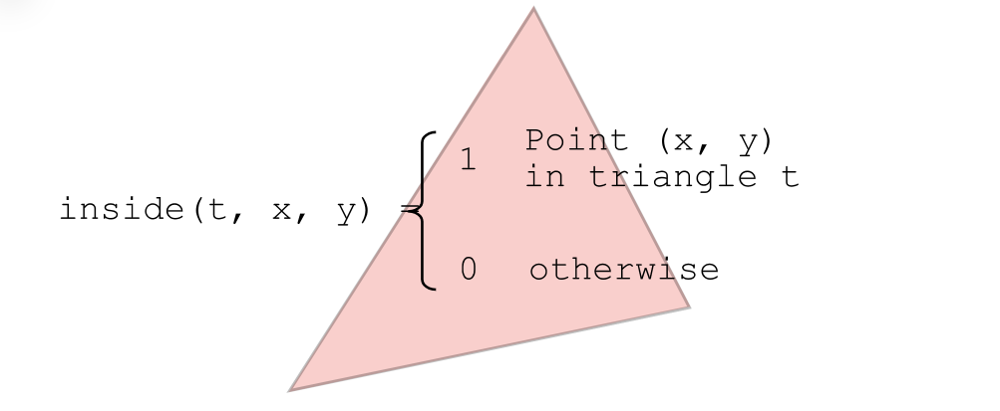

**Rasterization = Sampling A 2D Indicator Function**
``` txt
for (int x = 0; x <  xmax; ++x)
    for (int y = 0; y <  ymax; ++y)
        image[x][y] = inside(tri, x + 0.5, y + 0.5);
```
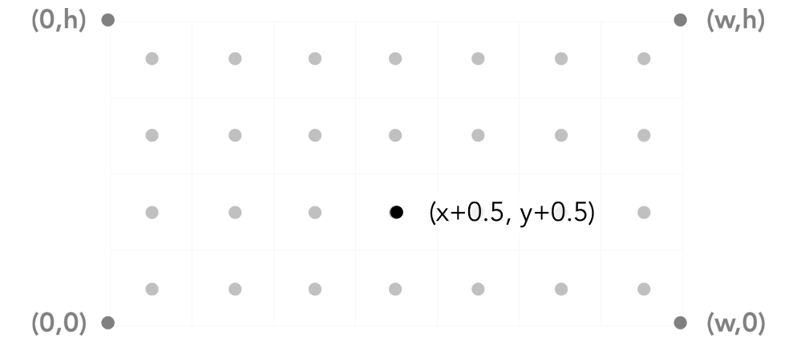

**Inside? Recall: Three Cross Products!(三次叉乘)**
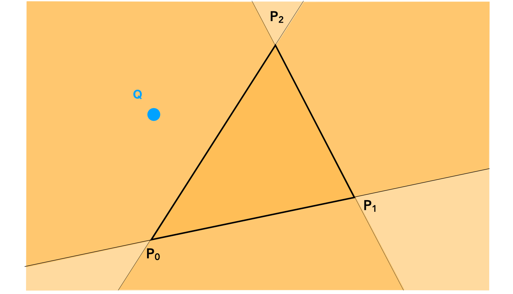

::: tip Some problems
**Edge Cases (Literally) 约定即可**
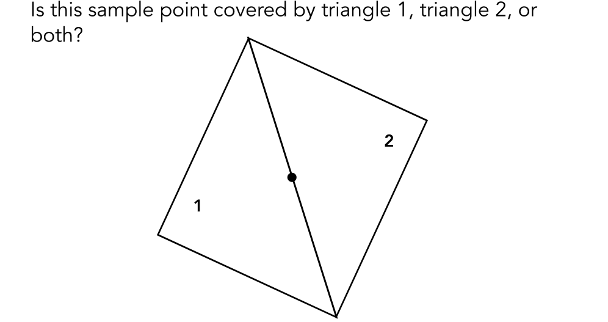

**Checking All Pixels on the Screen?**
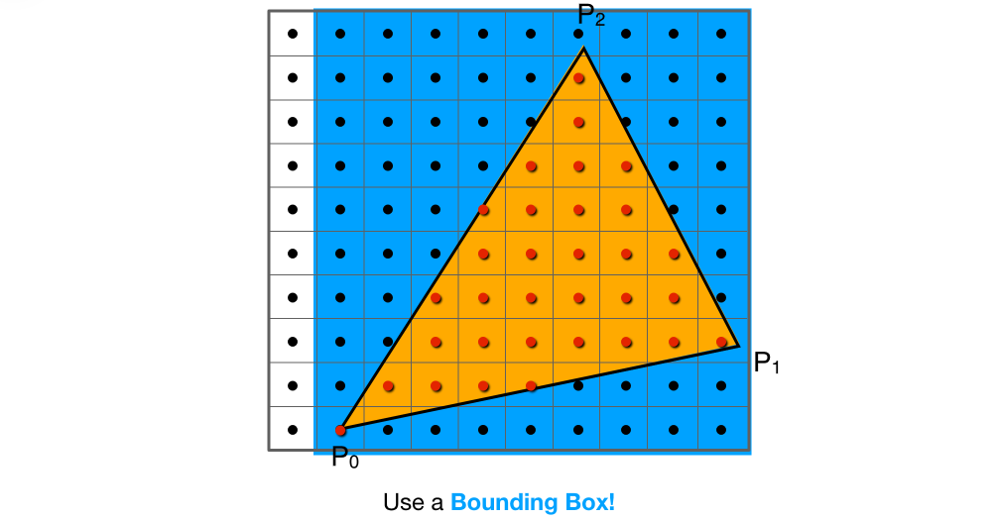

**Incremental Triangle Traversal (Faster?)**
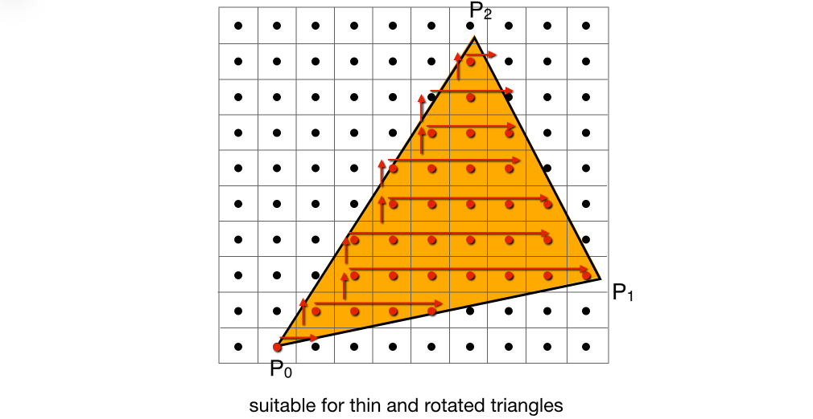
:::
### Rasterization on Real Displays

So, If We Send the Display the Sampled Signal
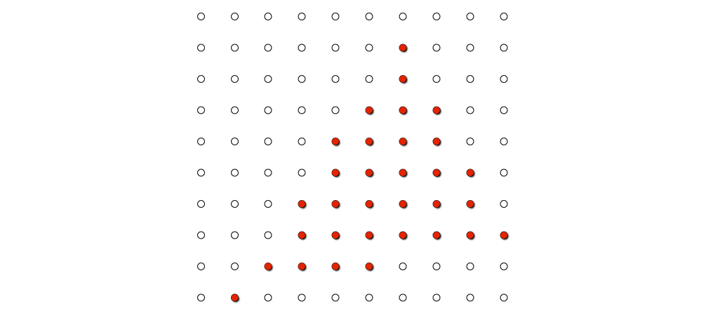
The Display Physically Emits This Signal
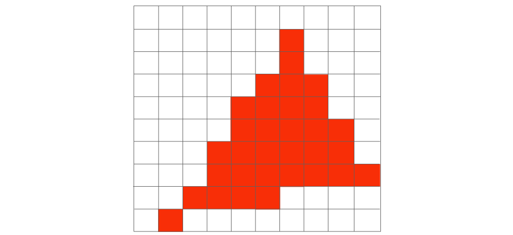
Compare: The Continuous Triangle Function
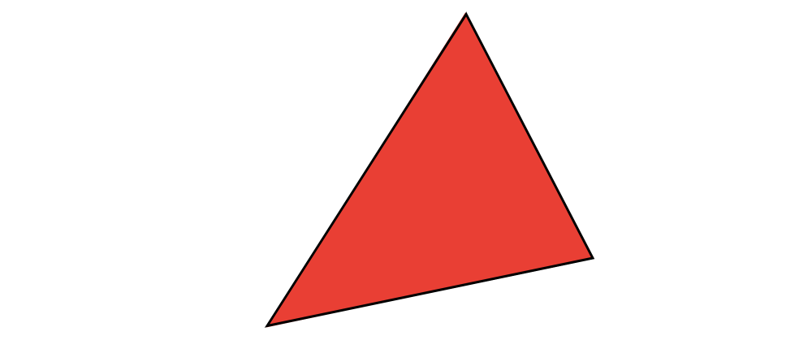

:::danger Jaggies!
Aliasing (Jaggies)
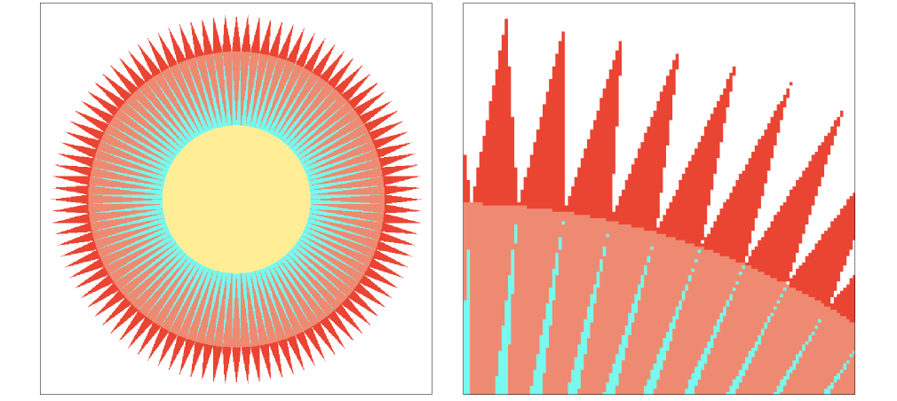
:::
