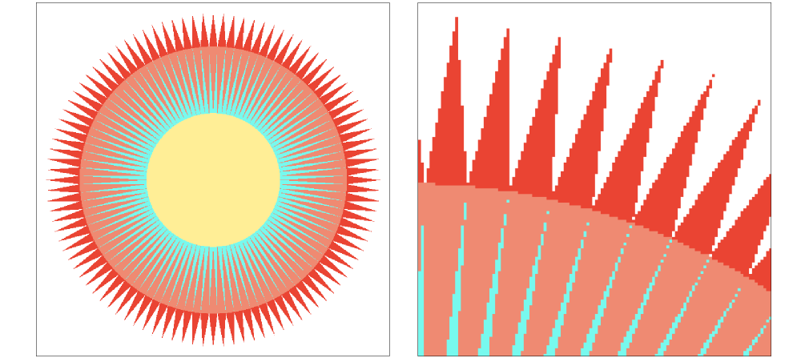

# 光栅化(Rasterization Cont)
:::tip 关于
Antialiasing and Z-Buffering (反走样(抗锯齿)和深度缓冲)

**锯齿的学名:走样**

- Antialiasing (反走样)
    - Sampling theory (采样理论)
    - Antialiasing in practice (实践中的反走样 )
- Visibility / occlusion (可见性/遮挡)
    - Z-buffering
:::

## Sampling Artifacts (Errors / Mistakes / Inaccuracies) in Computer Graphics

:::info Artifacts due to sampling - “Aliasing” (采样产生的伪影——“混叠”)
1. Jaggies (Staircase Pattern) 锯齿(楼梯形状)

2. Moiré Patterns in Imaging (摩尔纹)

**Skip odd rows and columns (跳过奇数行和奇数列)**

3. Wagon Wheel Illusion (False Motion) (车轮错觉(假动作))

人眼在时间上的采样跟不上运动的速度

4. [Many more]...
:::

::: tip Behind the Aliasing Artifacts (原因)
- Signals are changing too fast (high frequency), but sampled too slowly (信号变化太快(高频)但采样太慢)
:::

## 解决方案

Antialiasing Idea: Blurring (Pre-Filtering) Before Sampling (抗锯齿思想:采样之前做模糊(预滤波))

:::info Point Sampling vs Antialiasing (点采样 vs 抗锯齿)

    
    

---

    
    

---

Antialiasing vs Blurred Aliasing

Sample then filter, WRONG!

    
    

:::

:::warning But Why?
1. Why undersampling introduces aliasing?
2. Why pre-filtering then sampling can do antialiasing?

Let’s dig into fundamental reasons 
And look at how to implement antialiased rasterization
:::

## Frequency Domain (频域)

::: info Sines and Cosines

$$ \cos{2 \pi x} $$

$$ \sin{2 \pi x} $$

:::

::: info Frequencies (频率)

$$ \cos{2 \pi x} $$ 
$$ f=1 $$

$$ \cos{4 \pi x} $$ 
$$ f=2 $$
---
$$ \cos{2 \pi fx} $$
$$ f=\frac{1}{T} $$
:::

::: info Fourier Transform (傅里叶变换)

:::
::: info (滤波)

:::

