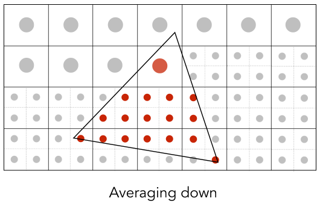

# 光栅化(Rasterization Cont)
:::tip 关于
Antialiasing and Z-Buffering (反走样(抗锯齿)和深度缓冲)

**锯齿的学名:走样**

- Antialiasing (反走样)
    - Sampling theory (采样理论)
    - Antialiasing in practice (实践中的反走样 )
- Visibility / occlusion (可见性/遮挡)
    - Z-buffering
:::

## Sampling Artifacts (Errors / Mistakes / Inaccuracies) in Computer Graphics (采样时会出现的问题)

:::info Artifacts due to sampling - “Aliasing” (采样产生的伪影——“混叠”)
1. Jaggies (Staircase Pattern) 锯齿(楼梯形状)

2. Moiré Patterns in Imaging (摩尔纹)

**Skip odd rows and columns (跳过奇数行和奇数列)**

3. Wagon Wheel Illusion (False Motion) (车轮错觉(假动作))

人眼在时间上的采样跟不上运动的速度

4. [Many more]...
:::

::: tip Behind the Aliasing Artifacts (原因)
- Signals are changing too fast (high frequency), but sampled too slowly (信号变化太快(高频)但采样太慢)
:::

## Antialiasing (抗锯齿)

Antialiasing Idea: Blurring (Pre-Filtering) Before Sampling (抗锯齿方法: 采样之前做模糊(预滤波))

:::info Point Sampling vs Antialiasing (点采样 vs 抗锯齿)

    
    

---

    
    

---

Antialiasing vs Blurred Aliasing

Sample then filter, WRONG!

    
    

:::

:::warning But Why?
1. Why undersampling introduces aliasing?
2. Why pre-filtering then sampling can do antialiasing?

Let’s dig into fundamental reasons 
And look at how to implement antialiased rasterization
:::

## Frequency Domain (频域)

::: info Sines and Cosines

$$ \cos{2 \pi x} $$

$$ \sin{2 \pi x} $$

:::

::: info Frequencies (频率)

$$ \cos{2 \pi x} $$ 
$$ f=1 $$

$$ \cos{4 \pi x} $$ 
$$ f=2 $$
---
$$ \cos{2 \pi fx} $$
$$ f=\frac{1}{T} $$
:::

## Fourier Transform (傅里叶变换)
::: info Fourier Transform (傅里叶变换)

- **Represent a function as a weighted sum of sines and cosines (将函数表示为正弦和余弦的加权和)**

$$ f(x)= \frac{A}{2} + \frac{2A\cos{(t\omega)}}{\pi} - \frac{2A\cos{(3t\omega)}}{3\pi}+\frac{2A\cos{(5t\omega)}}{5\pi}-\frac{2A\cos{(7t\omega)}}{7\pi} +...  $$

- Fourier Transform Decomposes A Signal Into Frequencies (傅里叶变换会将时域转化为频域)

- Higher Frequencies Need Faster Sampling (更高的频率需要更快的采样)

- Undersampling Creates Frequency Aliases
    - High-frequency signal is insufficiently sampled: samples erroneously appear to be from a low-frequency signal (高频信号采样不足:采样错误地显示为来自低频信号)
    - Two frequencies that are indistinguishable at a given sampling rate are called “aliases” (在给定采样率下无法区分的两个频率称为“别名”)

:::
## Filtering (滤波)
::: info Filtering (滤波)

Filtering = Getting rid of certain frequency contents (过滤= 摆脱某些频率内容)

- Visualizing Image Frequency Content (可视化图像频率内容)

    
    

- Filter Out Low Frequencies Only (Edges) (滤除低频(边缘))

  高通滤波: 只显示高频信息（只显示边界-锐化，将低频信息盖住)

    
    

- Filter Out High Frequencies (Blur) (滤除高频(模糊))

  低通滤波: 只显示低频滤波（画面变模糊，将高频信息盖住)

    
    

- Filter Out Low and High Frequencies (滤除低频和高频)

    
    

    
    

:::

## Convolution (卷积)
::: info Convolution (卷积)

- **Filtering = Convolution (= Averaging) (滤波=卷积 (=平均))**
    
    

    **Point-wise local averaging in a “sliding window”(“滑动窗口”中的逐点局部平均)**

    

        
        
    

- Convolution Theorem (卷积定理)

    简化的定义: 结果为相邻数的平均值

    *Convolution Theorem: Convolution in the spatial domain is equal to multiplication in the frequency domain, and vice versa (卷积定理): 时域的卷积等于频域的乘积*

    - Option 1: 
        - Filter by convolution in the spatial domain (在空间域中通过卷积滤波)
    - Option 2: 
        - Transform to frequency domain (Fourier transform) (变换到频域(傅里叶变换))
        - Multiply by Fourier transform of convolution kernel (乘以卷积核的傅里叶变换)
        - Transform back to spatial domain (inverse Fourier) (变换回空间域(傅里叶反变换))

- Box Filter
    
    - Box Function = “Low Pass” Filter

    

        
        
    

    - Wider Filter Kernel = Lower Frequencies

    

        
        
    

:::

## 来源及解决

::: info

- Sampling = Repeating Frequency Contents (采样=重复频率内容)

    

    来源[games101]: https://www.researchgate.net/figure/The-evolution-of-sampling-theorem-a-The-time-domain-of-the-band-limited-signal-and-b_fig5_301556095

- Aliasing = Mixed Frequency Contents (混叠=混合频率内容)
    
    
    由于采样稀疏，因此出现频谱混叠从而出现锯齿（走样）如果屏幕中像素非常多，密集的采样就不容易出现走样。

    因此使用分辨率高的显示器，频谱的搬移间隔大，不容易出现频谱混叠。
:::

:::tip 
- How Can We Reduce Aliasing Error?
    - Option 1: Increase sampling rate (提高采样率)
        - Essentially increasing the distance between replicas in the Fourier domain (本质上是增加了傅立叶域中副本之间的距离)
        - Higher resolution displays, sensors, framebuffers… (更高分辨率的显示器、传感器、帧缓冲区……)
        - But: costly & may need very high resolution (但是:昂贵并且可能需要非常高的分辨率)
    - Option 2: Antialiasing (反走样)
        - Making Fourier contents “narrower” before repeating (在重复之前使傅里叶内容“更窄”)
        - i.e. Filtering out high frequencies before sampling (即: 在采样前滤除高频)
        
- Regular Sampling (常规取样)
    
- Antialiased Sampling (反走样采样)
    
- Antialiasing By Averaging Values in Pixel Area (通过在像素区域的平均值来反走样)
    - Solution:
        - Convolve f(x,y) by a 1-pixel box-blur (对f(x,y)进行1像素的框模糊卷积)  
          - Recall: convolving = filtering = averaging (卷积=滤波=平均)
        - Then sample at every pixel’s center (然后再对每个像素的中心取样)
    
    In rasterizing one triangle, the average value inside a pixel area of f(x,y) = inside(triangle,x,y) is equal to the area of the pixel covered by the triangle. (在光栅化一个三角形时，f(x,y) = inside(triangle,x,y)在像素区域内的平均值等于该三角形所覆盖的像素面积。)
    

- Antialiasing By Supersampling (MSAA) (通过超采样抗锯齿 (MSAA))
    
    MSAA: Antialiasing By Supersampling

    Approximate the effect of the 1-pixel box filter by sampling multiple locations within a pixel and averaging their values (通过采样一个像素内的多个位置并取其值的平均值来近似1像素盒滤波器的效果)

    
    
    ---
    
    

    - Supersampling: Step 1
        Take NxN samples in each pixel.
        
    - Supersampling: Step 2
        Average the NxN samples “inside” each pixel.
        
        
    - Supersampling: Result
        This is the corresponding signal emitted by the display
        
:::

::: info 结尾

- What’s the cost of MSAA? 

    增加了很多的计算量

- 其他的抗锯齿方法
    - FXAA (Fast Approximate AA)
    - TAA (Temporal AA)

- Super resolution / super sampling (Super resolution / super sampling)
    - From low resolution to high resolution (从低分辨率处理成高分辨率)
    - Essentially still “not enough samples” problem (本质上仍然是“样本不足”的问题)
    - DLSS (Deep Learning Super Sampling) (目前可使用DLSS进行超级采样)
:::

