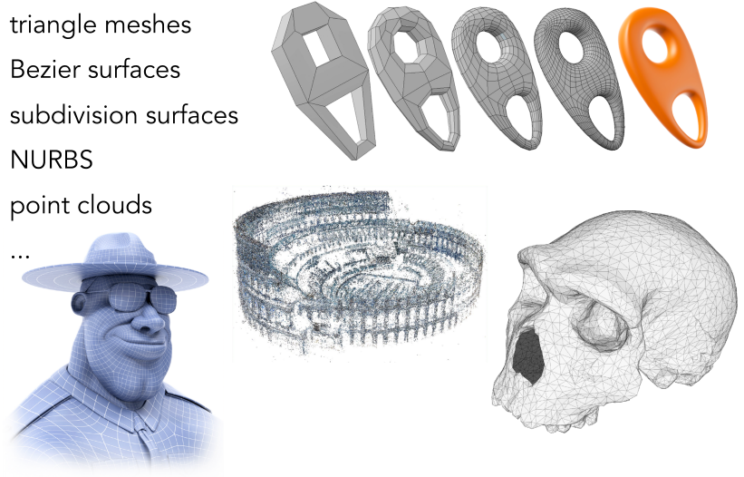
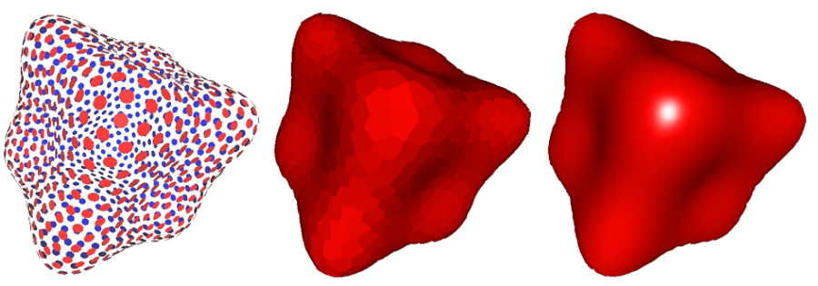
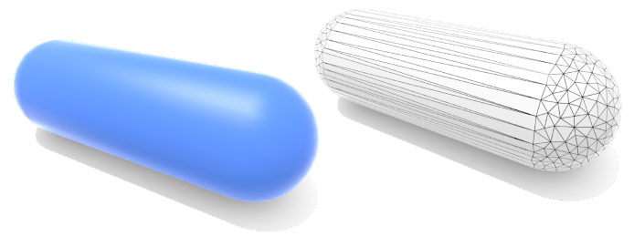
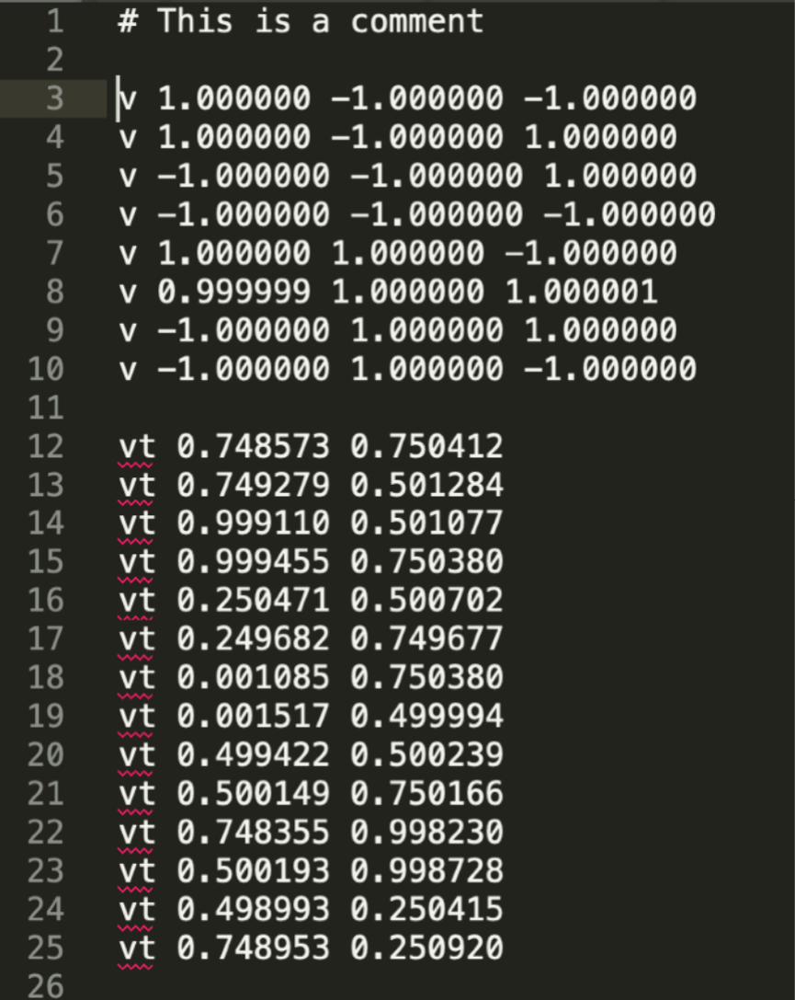
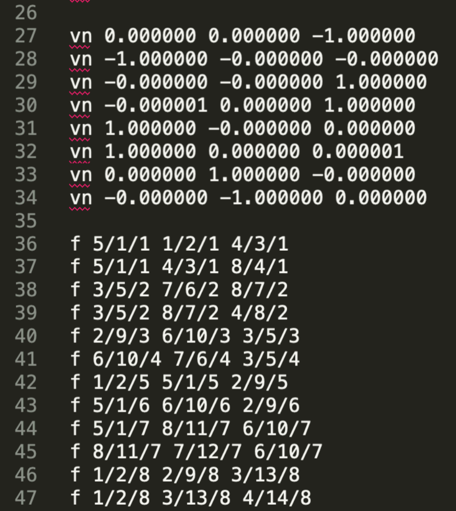

# 几何

:::tip 这节课

- Introduction to geometry
    - Examples of geometry 
    - Various representations of geometry (几何的各种表示)

:::

## Many Ways to Represent Geometry

## (隐式) Implicit Representations of Geometry

Based on classifying points (基于分类点)
- Points satisfy some specified relationship (点满足某种特定的关系)

E.g. sphere: all points in 3D, where $x^2+y^2+z^2 = 1$ 

More generally, $f(x,y,z) = 0$

:::info Implicit Surface – Sampling Can Be Hard (隐式表面采样可能很难)

$f(x,y,z) = (2 - \sqrt{x^2 + y^2})^2 + z^2 - 1$

Some tasks are hard with implicit representations (有些任务很难使用隐式表示)

:::

:::info Implicit Surface – Inside/Outside Tests Easy (隐式表面-内部/外部测试容易)

$f(x,y,z) = x^2 + y^2 + z^2 -1$

Implicit representations make some tasks easy (隐式表示使一些任务变得容易)

:::

### More Implicit Representations in Computer Graphics

#### Algebraic Surfaces (Implicit) (代数曲面(隐式))
Surface is zero set of a polynomial in x, y, z (曲面是x, y, z的多项式的零集)

#### Constructive Solid Geometry (Implicit)
Combine implicit geometry via Boolean operations (复杂的几何体通过简单几何体进行集合运算（交并补）得到，该操作被称之为CSG)

#### Distance Functions (Implicit) (距离函数)

Instead of Booleans, gradually blend surfaces together using 
Distance functions: giving minimum distance (could be signed distance) from anywhere to object 

An Example: Blending (linear interp.) a moving boundary (一个例子:混合(线性插值)一个移动的边界)

##### Blending Distance Functions (Implicit)
Can blend any two distance functions d1, d2: 

#### Level Set Methods (Also implicit) (水平集)
Closed-form equations are hard to describe complex shapes 
Alternative: store a grid of values approximating function (封闭形式的方程很难描述复杂的形状 备选方案:存储一个网格值逼近函数)

Surface is found where interpolated values equal zero 
Provides much more explicit control over shape (like a texture) (找到插值值为零的曲面 对形状(如纹理)提供更显式的控制)

##### Level Sets from Medical Data (CT, MRI, etc.)

Level sets encode, e.g., constant tissue density

##### Level Sets in Physical Simulation
Level set encodes distance to air-liquid boundary

#### Fractals (Implicit) (分型)
Exhibit self-similarity, detail at all scales 

"Language" for describing natural phenomena 

Hard to control shape! (展示自相似性，所有尺度的细节 描述自然现象的“语言” 难以控制形状!)

    
    
    

### Implicit Representations - Pros & Cons (隐式表示-优点和缺点)
Pros: 
- compact description (e.g., a function) (紧凑的描述(例如，一个函数))
- certain queries easy (inside object, distance to surface) (某些查询很容易(对象内部，到表面的距离))
- good for ray-to-surface intersection (more later) (适用于光线与表面的相交)
- for simple shapes, exact description / no sampling error (对于简单的形状，精确的描述/无采样误差)
- easy to handle changes in topology (e.g., fluid) (易于处理拓扑变化(例如，流体))

Cons:
- difficult to model complex shapes (难以模拟复杂的形状)

## (显式) Explicit Representations in Computer Graphics
:::info Many Explicit Representations in Graphics

:::

### Point Cloud (Explicit) (点云)
Easiest representation: list of points (x,y,z)

Easily represent any kind of geometry 

Useful for LARGE datasets (>>1 point/pixel)

Often converted into polygon mesh

Difficult to draw in undersampled regions 

### Polygon Mesh (Explicit) (多边形网格)
Store vertices & polygons (often triangles or quads) (存储顶点和多边形(通常是三角形或四边形))

Easier to do processing / simulation, adaptive sampling (更容易做处理/模拟，自适应采样)

More complicated data structures (更复杂的数据结构)

Perhaps most common representation in graphics(也许在图形中应用最广泛)

### The Wavefront Object File (.obj) Format (波前对象文件(.obj)格式)

Commonly used in Graphics research 

Just a text file that specifies vertices, normals, texture coordinates and their connectivities (只是一个文本文件，指定顶点，法线，纹理坐标和它们的连接)

下图定义了一个立方体，有八个顶点（v）,六个面（vn）多个纹理坐标（vt）表示，然后使用f表示他们之间的关系(f(v/vt/vn))

    
    

