# 几何

:::tip 关于
- Curves (曲线)
    - Bezier Curves (贝塞尔曲线)
    - De Casteljau’s algorithm 
    - B-splines, etc. 
- Surfaces
    - Bezier surfaces 
    - Triangles & quads (三角形&四边形)
    - Subdivision, simplification, regularization (细分、简化、规范化)
:::

## Curves

### Bezier Curves (贝塞尔曲线)

Defining Cubic Bézier Curve With Tangents

只要求一定要经过起止点, 起止点之间的若干个控制点用于控制曲线弯曲的方向, 最终形成一条经过起止点的光滑曲线被成为贝塞尔曲线.

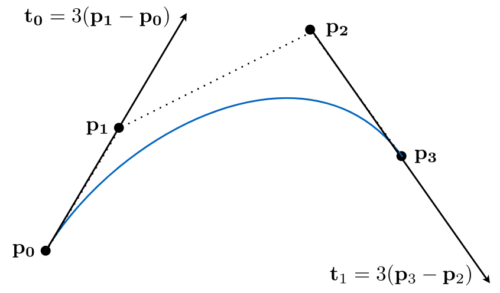

:::info Bézier Curves – de Casteljau Algorithm

Consider three points (quadratic Bezier) (考虑三个点(二次贝塞尔))

Insert a point using linear interpolation (使用线性插值插入一个点)

    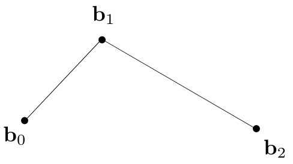
    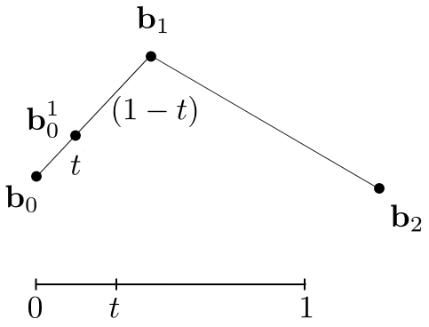

Insert on both edges (两边插入)

Repeat recursively (重复递归)

Run the same algorithm for every t in [0,1] (对[0,1]中的每个t运行相同的算法)

    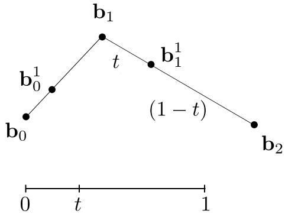
    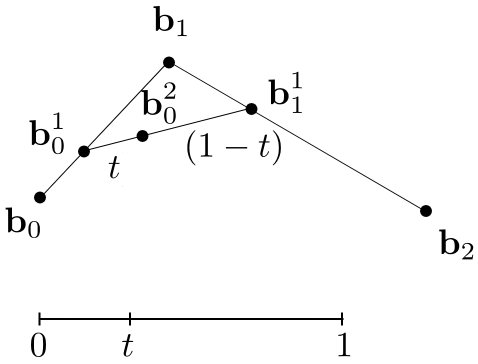
    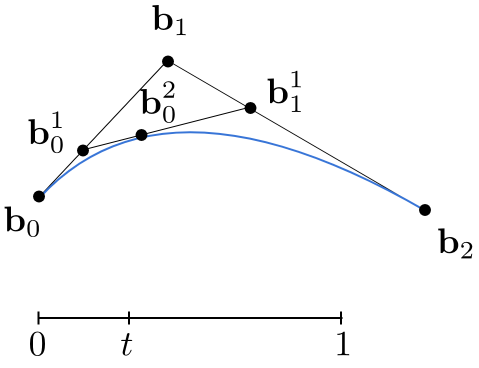

**Cubic Bézier Curve – de Casteljau**

Four input points in total, Same recursive linear interpolations (总共四个输入点, 同样的递归线性插值)
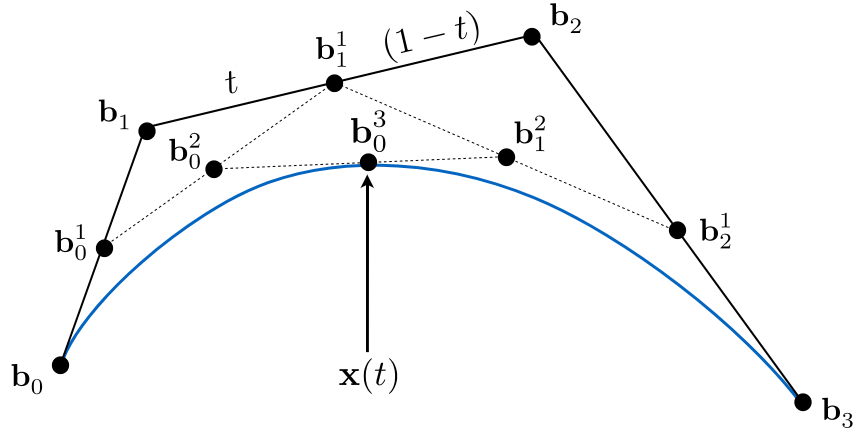

:::

### Evaluating Bézier Curves Algebraic Formula (算法评估)
:::tip Bézier Curve – Algebraic Formula (公式)

de Casteljau algorithm gives a pyramid of coefficients (给出了系数金字塔?)
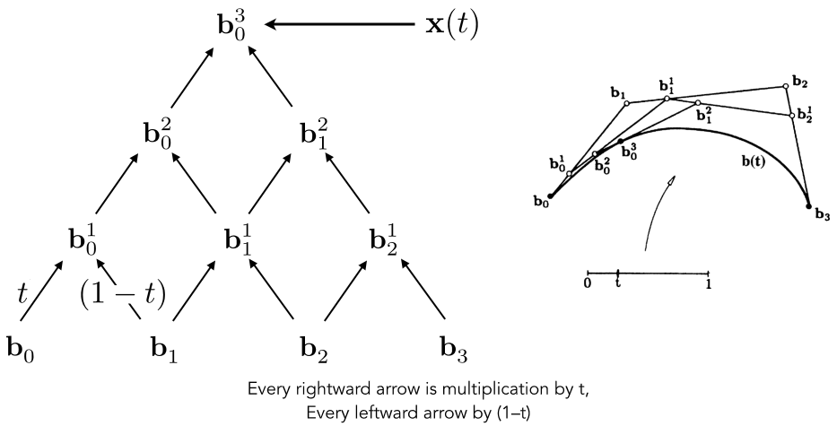

Example: quadratic Bézier curve from three points

- 引入参数t(范围[0, 1])
- 取$b_0$到$b_1$, $b_1$到$b_2$上t位置的点$b_0^1$,$b_1^1$
- 将$b_0^1$, $b_1^1$连接
- 取$b_0^1$到$b_1^1$ t位置上的点$b_0^2$
- 将[0, 1]上所有的$b_0^2$点都遍历一份相连即可得到**贝塞尔曲线**
- 若有n个控制点则将上面步骤进下递归操作直到找到最终位移$b_0^n$
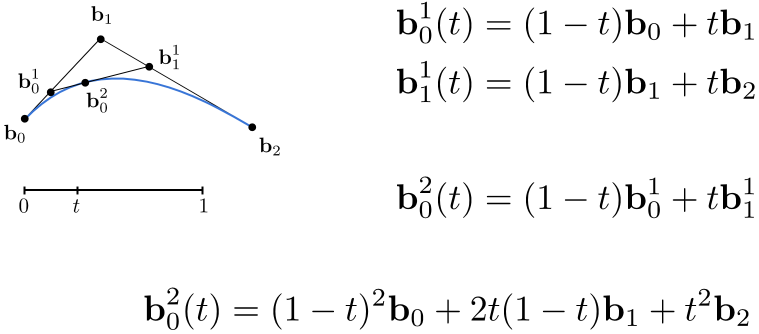

**Bernstein form of a Bézier curve of order n: (n阶公式)**

$$ b^n(t) = b_0^n(t) = \sum_{j=0}^n b_j B_j^n(t) $$

$b^n(t)$: Bézier curve order n (vector polynomial of degree n)

$b_j$: Bézier control points (vector in $R^N$) (贝塞尔控制点)

$B_j^n(t)$: Bernstein polynomial (scalar polynomial of degree n) (伯恩斯坦多项式)

**求得以t为自变量的函数, 由这些点形成的集合构成贝塞尔曲线.**

Bernstein polynomials (伯恩斯坦多项式): 

$$ B_i^n(t) = \begin{pmatrix} n \\\\ i \\\\ \end{pmatrix} t^i (1-t)^{n-i} $$ 

Example: assume n = 3 and we are in R³

i.e. we could have control points in 3D such as:

$$b_0 = (0, 2, 3), b_1 = (2, 3, 5), b_2 = (6, 7, 9), b_3 = (3, 4, 5)$$

These points define a Bezier curve in 3D that is a cubic polynomial in t:

$$b^n(t) = b_0 (1 − t)^3 + b_1 3t(1 − t)^2 + b_2 3t^2(1 − t) + b_3 t^3$$

- 对贝塞尔曲线做仿射变换只需要对控制点、起止点做仿射变换再重新绘制一遍即可
- 对投影变换没有这样的性质
:::

:::info Convex Hull (凸包)

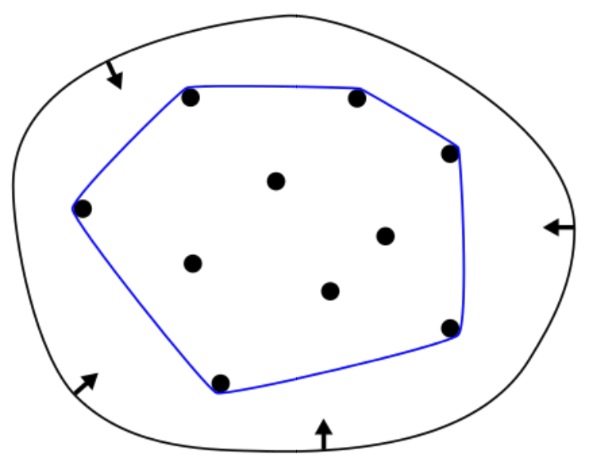

- 贝塞尔曲线拥有凸包的性质
- 连接贝塞尔曲线最外围的控制点, 将其相互连接形成一个封闭空间, 画出来的贝塞尔曲线一定在凸包范围内
- 若贝塞尔曲线是一个直线则凸包也是一个直线
:::

### Piecewise Bézier Curves (分段贝塞尔曲线)

高阶贝塞尔曲线难以控制, 不常用.
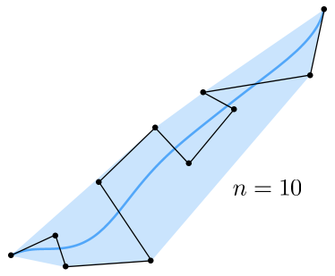

Instead, chain many low-order Bézier curve, Piecewise cubic Bézier the most common technique

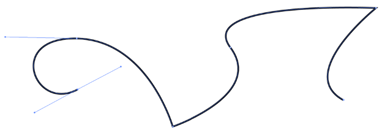

若想要逐段贝塞尔曲线平滑过渡则需要将相邻控制点共线, 否则会出现该曲线后边段的不平滑现象.

Widely used (fonts, paths, Illustrator, Keynote, …) (广泛使用(字体，路径，Illustrator, Keynote，…))

Demo: David Eck, http://math.hws.edu/eck/cs424/notes2013/canvas/bezier.html

:::info 连续

Two Bézier curves 

$$a:[k, k+1] \rightarrow IR^N$$
$$b:[k+1, k+2] \rightarrow IR^N$$

Assuming integer partitions here, can generalize (假设这里是整数分区，可以推广)

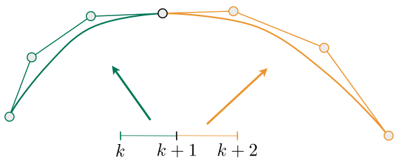

$C^0$ continuity: $a_n = b_0$ **(将两个逐段贝塞尔曲线中的两部分连接, 连接点被称之为$C^0$连续)**

$C^1$ continuity: $a_n = b_0 = {1\over 2}(a_{n-1}+b_1)$ **(若相邻两个控制点距离连接点相同且共线则该连接点被称之为$C^1$连续(在连接处一阶连续可导))**

    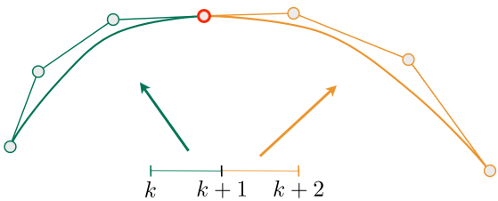
    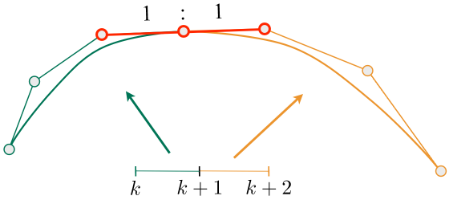

:::

## Bézier Surfaces

Extend Bézier curves to surfaces (扩展到曲面)

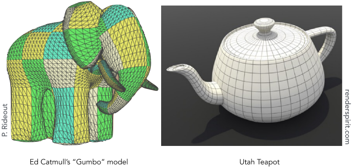

### Bicubic Bézier Surface Patch (双立方贝塞尔表面贴片)
Bezier surface and 4 x 4 array of control points
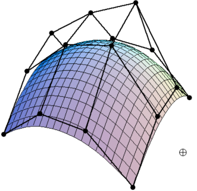

### Evaluating Bézier Surfaces (评估)
Evaluating Surface Position For Parameters (u,v) (求参数(u,v)的曲面位置)

For bi-cubic Bezier surface patch, 

Input: 4x4 control points 

Output is 2D surface parameterized by (u,v) in [0,1]2 

(对于双立方贝塞尔曲面贴片，输入:4x4个控制点 输出为2D曲面，参数化为[0,1]2中的(u,v))
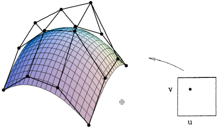

:::tip Method: Separable 1D de Casteljau Algorithm
Goal: Evaluate surface position corresponding to (u,v) 

(u,v)-separable application of de Casteljau algorithm 
- Use de Casteljau to evaluate point u on each of the 4 Bezier curves in u. This gives 4 control points for the “moving” Bezier curve
- Use 1D de Casteljau to evaluate point v on the “moving” curve 

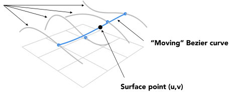

懒得翻译了, 大概思路就是: 与二维的贝塞尔曲线思想类似, 但是需要定义两个参数u和v(取代之前的参数t)

先对f(u)进行遍历得到曲线，再嵌套遍历得到曲面f(u, v), 类似于两层for循环进行遍历.

:::
