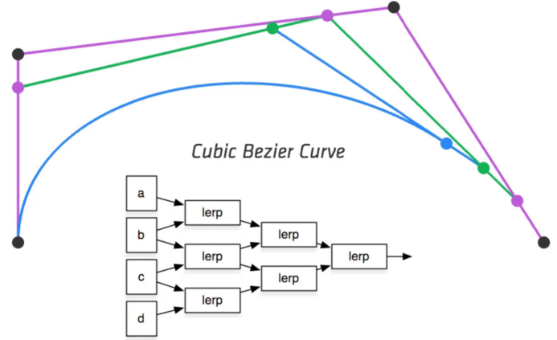

# 几何

:::tip 关于
- Curves (曲线)
    - Bezier Curves (贝塞尔曲线)
    - De Casteljau’s algorithm 
    - B-splines, etc. 
- Surfaces
    - Bezier surfaces 
    - Triangles & quads (三角形&四边形)
    - Subdivision, simplification, regularization (细分、简化、规范化)
:::

## Curves

### Bezier Curves (贝塞尔曲线)

Defining Cubic Bézier Curve With Tangents

只要求一定要经过起止点, 起止点之间的若干个控制点用于控制曲线弯曲的方向, 最终形成一条经过起止点的光滑曲线被成为贝塞尔曲线.

### Bézier Curves – de Casteljau Algorithm

Consider three points (quadratic Bezier) (考虑三个点(二次贝塞尔))

Insert a point using linear interpolation (使用线性插值插入一个点)

Insert on both edges (两边插入)

Repeat recursively (重复递归)

Run the same algorithm for every t in [0,1] (对[0,1]中的每个t运行相同的算法)

Cubic Bézier Curve – de Casteljau

Four input points in total, Same recursive linear interpolations (总共四个输入点, 同样的递归线性插值)

Visualizing de Casteljau Algorithm

Animation: Steven Wittens, Making Things with Maths, http://acko.net
Evaluating Bézier Curves Algebraic Formula

de Casteljau algorithm gives a pyramid of coefficients

Example: quadratic Bézier curve from three points

