# 几何

## Mesh Operations: Geometry Processing (网格操作:几何处理)

- Mesh subdivision (细分)
- Mesh simplification (简化)
- Mesh regularization (规范化)

由左到右: 模型 正常网格 网格细分 网格简化 网格正规化

- Mesh Subdivision (upsampling) (网格细分(上采样))
    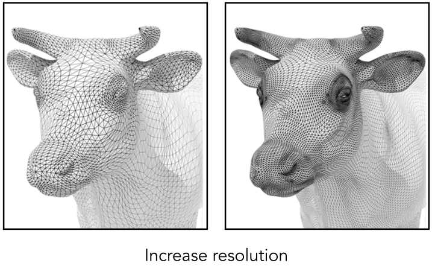

- Mesh Simplification (downsampling) (网格简化(下采样))
    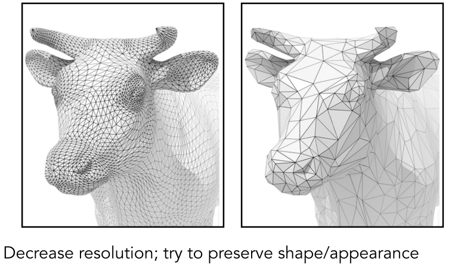

- Mesh Regularization (same #triangles) (网格正则化(相同的#三角形))
    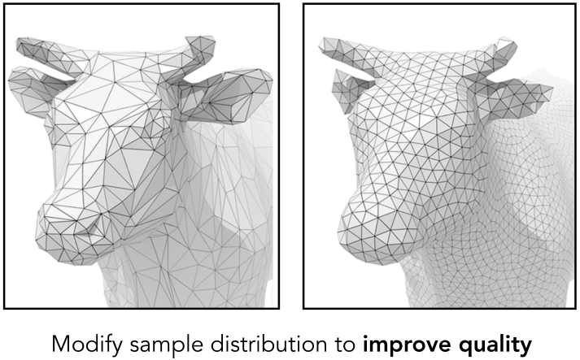

### Subdivision (细分)
#### Loop Subdivision (循环细分)

Common subdivision rule for **triangle meshes**. First, create more triangles (vertices). Second, tune their positions

(三角网格的常用细分规则 首先，创建更多的三角形(顶点) 第二，调整他们的位置)

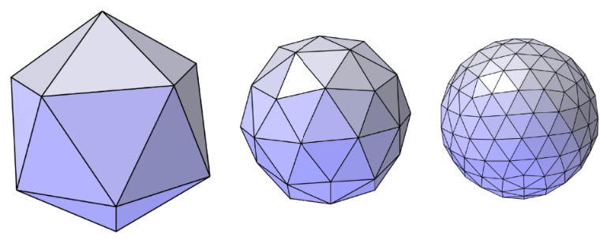

- Split each triangle into four
    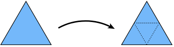
- Assign new vertex positions according to weights (根据权重分配新的顶点位置)
    - New / old vertices updated differently (新/旧顶点更新方式不同)
    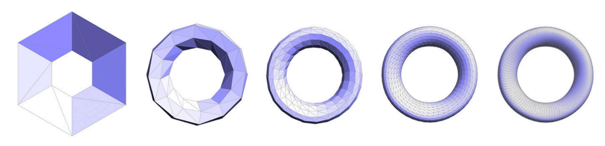

:::info Loop Subdivision — Update
For new vertices:
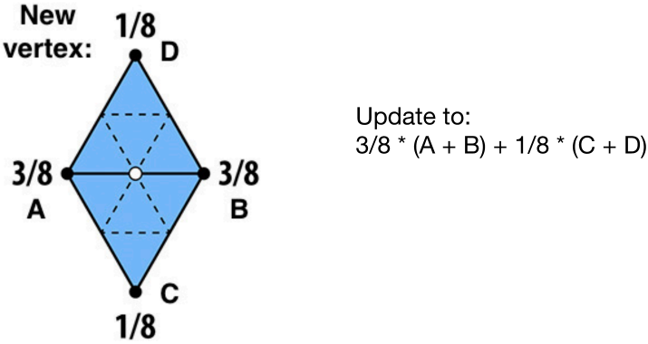
For old vertices (e.g. degree 6 vertices here):
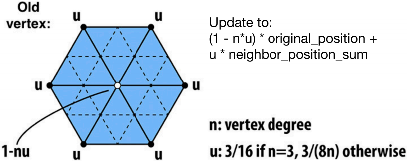
:::

注: 只能对完全为三角形的几何体进行细分

#### Catmull-Clark Subdivision (General Mesh) (Catmull-Clark细分(通用网格))
注: 相对于Loop细分, 可以用于任意不同的面的细分
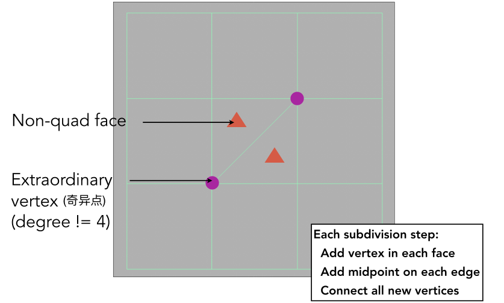
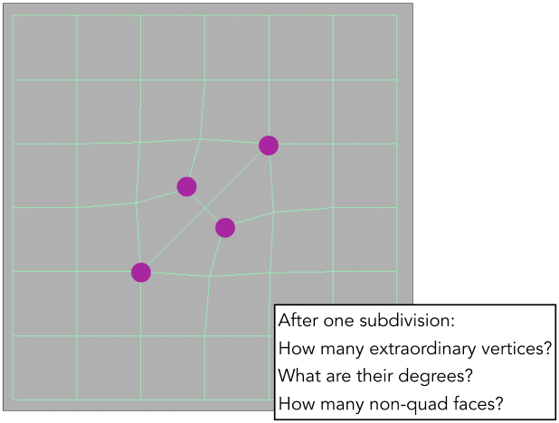

    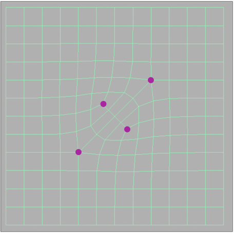
    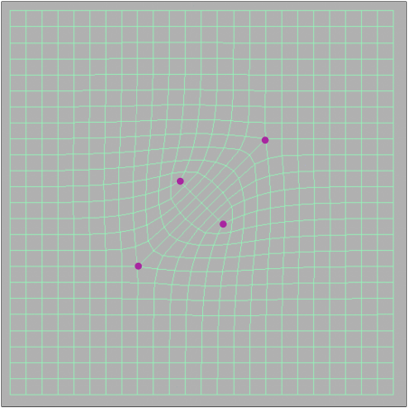

**FYI: Catmull-Clark Vertex Update Rules (Quad Mesh) (供参考:Catmull-Clark顶点更新规则(四边形网格))**

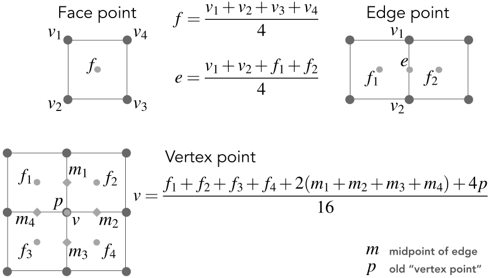

### Simplification (简化)
Goal: reduce number of mesh elements while maintaining the overall shape (目标: 在保持整体形状的同时减少网格元素的数)

距离模型远时效果相差不大, 可根据需求进行选择

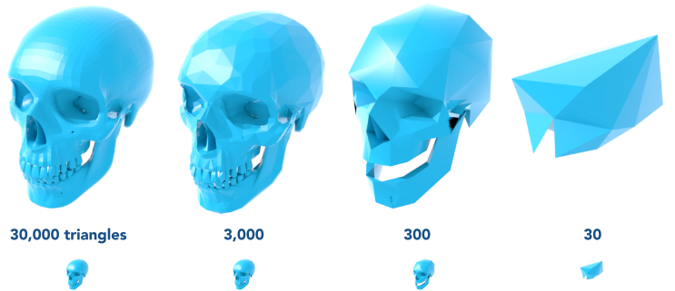

#### Collapsing An Edge (坍塌一条边)
- Suppose we simplify a mesh using edge collapsing (假设我们使用边缘折叠来简化一个网格)
    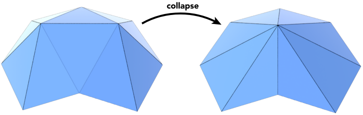

边坍缩面临的问题:
- 坍缩哪些面？
- 如果优先坍缩不重要的面，那如何界定不重要？
- 坍缩后的顶点位置如何描述

#### Quadric Error Metrics (二次误差度量)
- How much geometric error is introduced by simplification? (化简会带来多少几何误差?)
- Not a good idea to perform local averaging of vertices (执行顶点的局部平均不是一个好主意)
-  Quadric error: new vertex should minimize its sum of square distance (L2 distance) to previously related triangle planes! (二次误差:新的顶点应该最小化它的平方距离(L2距离)的总和之前相关的三角形平面!)

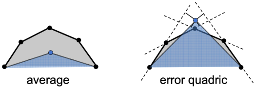

#### Quadric Error of Edge Collapse (边塌缩的二次误差)
- How much does it cost to collapse an edge? 
- Idea: compute edge midpoint, measure quadric error
- Better idea: choose point that minimizes quadric error 

#### Quadric Error Mesh Simplification
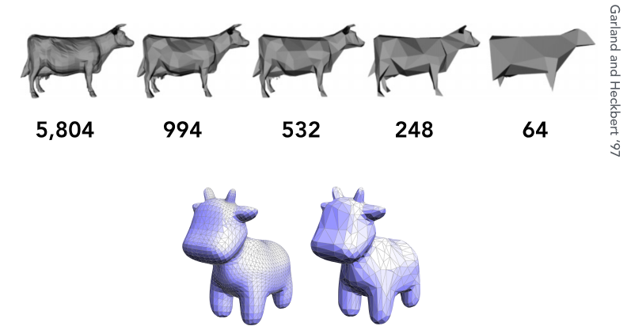

