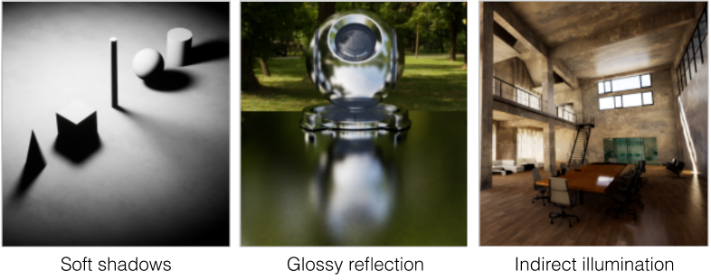
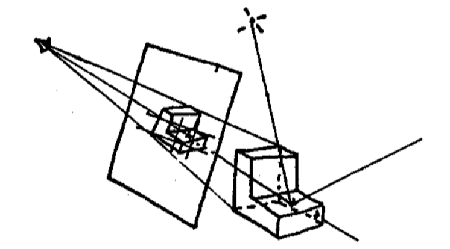
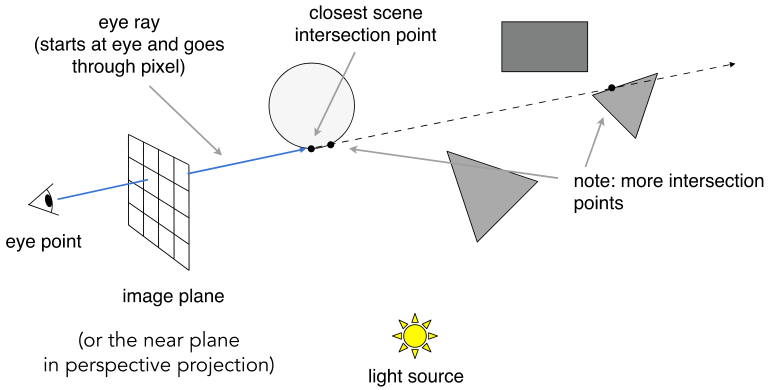

# Ray Tracing 1 (光线追踪) (Whitted-Style Ray Tracing)
:::tip Why Ray Tracing?
Rasterization couldn’t handle global effects well (光栅化不能很好地处理全局效果)

- (Soft) shadows ((软)阴影)
- And especially when the light bounces more than once (尤其是当光线反射不止一次的时候)
- Rasterization is fast, but quality is relatively low (光栅化速度很快，但质量相对较低)
- Ray tracing is accurate, but is very slow (光线追踪是准确的，但速度很慢)
    - Rasterization: real-time, ray tracing: offline (光栅化:实时，光线追踪:离线)
    - ~10K CPU core hours to render one frame in production

难以将以下效果做好

:::

## Basic Ray-Tracing Algorithm (基本光线追踪算法)

### Light Rays (光线)

Three ideas about light rays 
1. Light travels in straight lines (though this is wrong) (光沿直线传播(虽然这是错误的))
2. Light rays do not “collide” with each other if they cross (though this is still wrong) (光线交叉时不会相互“碰撞”(尽管这仍然是错误的)。) 
3. Light rays travel from the light sources to the eye (but the physics is invariant under path reversal - reciprocity). (光线从光源传播到眼睛(但物理是不变的路径反转-互惠)。)

"And if you gaze long into an abyss, the abyss also gazes into you." — Friedrich Wilhelm Nietzsche (translated) (如果你长时间凝视深渊，深渊也凝视着你。——弗里德里希·威廉·尼采)

### Ray Casting (射线投射)

**Appel 1968 - Ray casting**

1. Generate an image by casting one ray per pixel (通过每个像素投射一条光线来生成图像)
2. Check for shadows by sending a ray to the light (通过向光源发送光线来检查阴影)

**Ray Casting - Generating Eye Rays**

Pinhole Camera Model (针孔相机模型)

