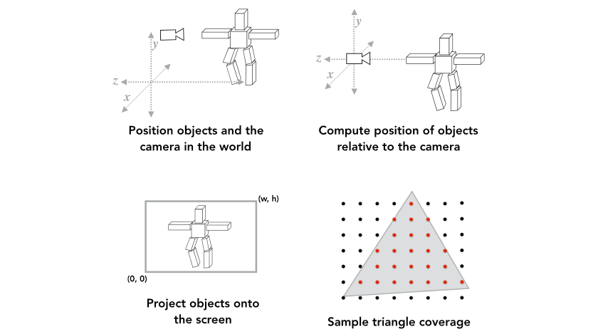
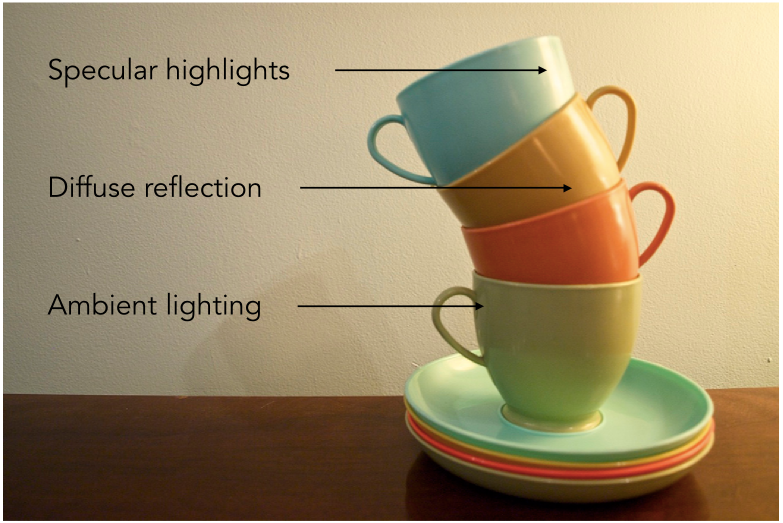
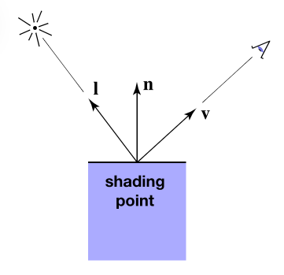
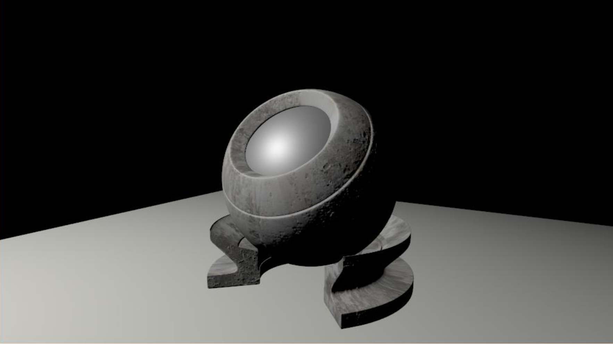
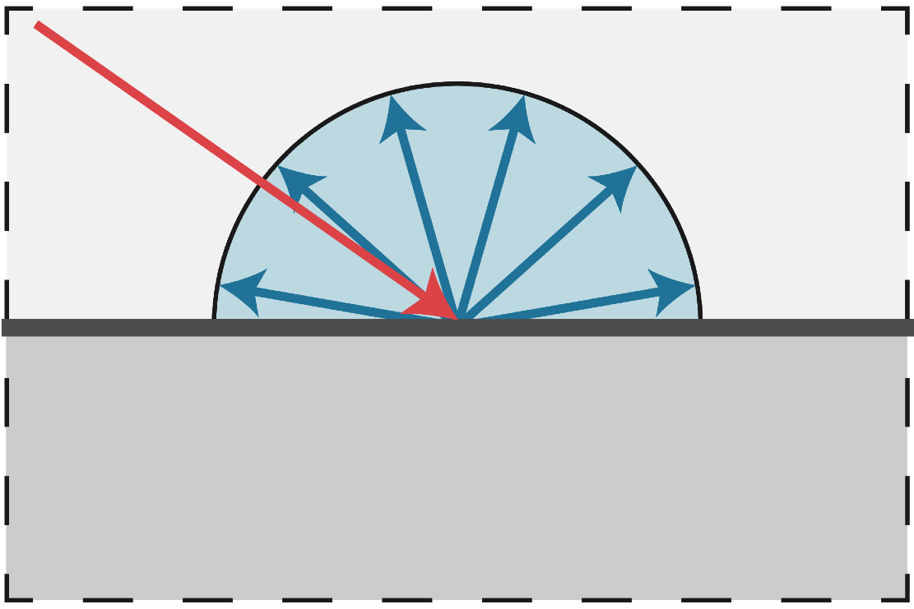
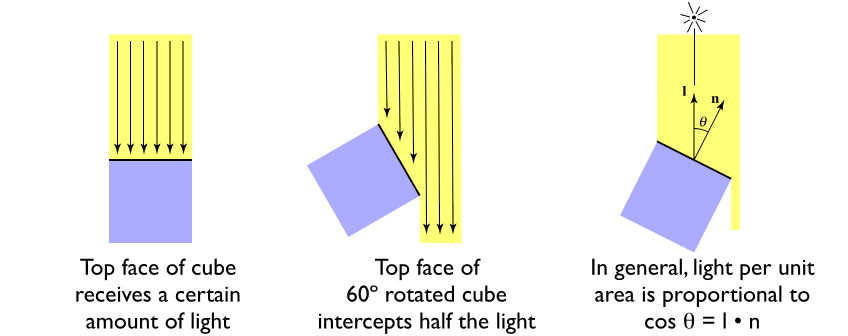
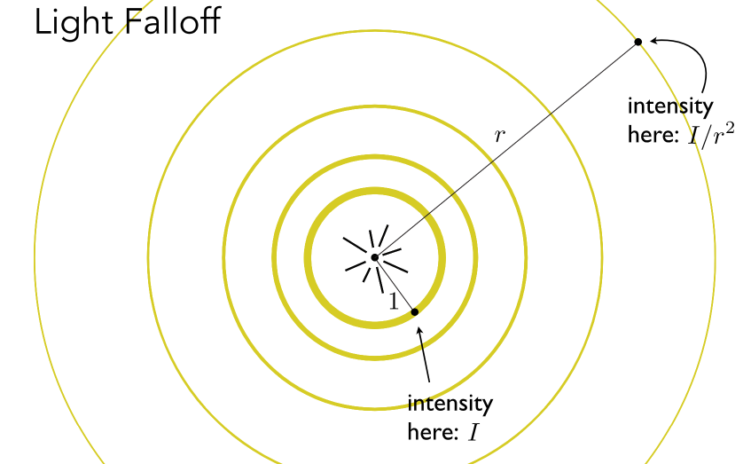
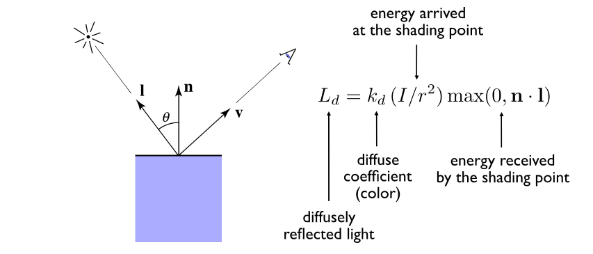
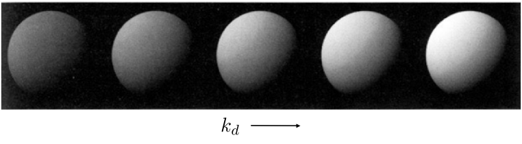

# Shading(Lumination, Shading and Graphics Pipeline) 

::: tip 关于
照明, 着色和图形管道

:::

## What We’ve Covered So Far (到目前为止我们已经涵盖了什么)

## Shading

Shading: Definition

**对不同的物体应用不同的材质的过程**

### Blinn-Phong Reflectance Model
:::info A Simple Shading Model (Blinn-Phong Reflectance Model) (一个简单的着色模型 (Blinn-Phong反射模型))

Perceptual Observations (感性的观察)

:::

::: info Shading is Local (阴影是局部的)
Compute light reflected toward camera at a specific 
shading point (计算在特定位置反射到相机的光 阴影点)

Inputs:
- Viewer direction, v (观察方向)
- Surface normal, n (表面法线)
- Light direction, I (for each of many lights) (光照方向，I(多个光源中的每一个))
- Surface parameters(color, shininess, …) (表面参数(颜色，亮度，…))

No shadows will be generated! (shading ≠ shadow) (没有阴影将生成!（ 阴影 ≠ 影子 ）) 

:::

#### Diffuse Reflection
:::info Diffuse Reflection (漫反射)
- Light is scattered uniformly in all directions (光在各个方向均匀地散射)
    - Surface color is the same for all viewing directions (表面颜色是相同的所有观看方向)

- But how much light (energy) is received? (但是接收了多少光(能量)呢?)
    - Lambert’s cosine law (兰伯特余弦定律)

- 光照衰减

:::

::: info Lambertian (Diffuse) Shading (兰伯特漫反射着色)
Shading independent of view direction (着色独立于观察角度)

:::