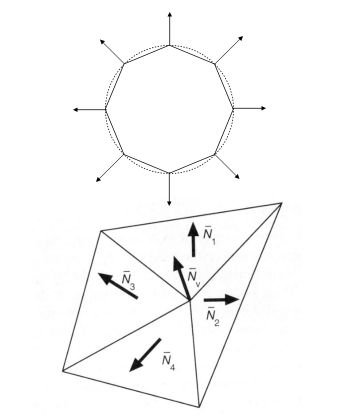

# Shading 

:::tip 这节课
- Blinn-Phong reflectance model 
    - Specular and ambient terms (高光和环境光)
- Shading frequencies (着色频率)
- Graphics pipeline (渲染管线)
- Texture mapping (纹理映射)

:::

## Blinn-Phong reflectance model
### Specular Term (Blinn-Phong) (高光)

Intensity depends on view direction (强度 取决于 在视图方向上)

- Bright near mirror reflection direction (明亮的近镜反射方向)


V close to mirror direction half vector near normal (V向量接近镜面方向一半的向量, 接近法向量)

- Measure “near” by dot product of unit vectors (用单位向量的点积来度量“近”)


:::tip Cosine Power Plots (余弦功率图)

Increasing p narrows the reflection lobe

解释了为什么要加指数p


:::

$$ L_s = k_s (I/r^2) max(0, n \cdot h)^p $$


### Ambient Term (环境光)

Shading that does not depend on anything  (阴影不依赖于任何东西)

- Add constant color to account for disregarded illumination and fill in black shadows (添加恒定的颜色来解释忽略的照明和填充黑色阴影)
- This is approximate / fake!


### Blinn-Phong Reflection Model


$$L=L_a + L_d + L_s = k_a I_a + k_d (I/r^2) max(0, n \cdot l) + k_s (I/r^2) max (0, n \cdot h)^p $$

## Shading Frequencies (着色频率)
What caused the shading difference?

:::info Shade each triangle (flat shading) (为每个三角形着色(平面着色))

Flat shading

- Triangle face is flat — one normal vector 
- Not good for smooth surfaces


:::
:::info Shade each vertex (Gouraud shading) (为每个顶点着色(顶点着色))
Gouraud shading

- Interpolate colors from vertices across triangle
- Each vertex has a normal vector (how?) 


:::

:::info Shade each pixel (Phong shading) (为每个像素着色(像素着色))
Phong shading (注:此Phong非彼Phong)

- Interpolate normal vectors across each triangle 
- Compute full shading model at each pixel 
- <font color="#F56C6C">Not the Blinn-Phong Reflectance Model</font>


:::

:::tip Face, Vertex or Pixel


如果面足够多, 最终效果相差不多, 但平面着色更高效.

:::

:::tip Defining Per-Vertex Normal Vectors (定义每个顶点的法向量)

Best to get vertex normals from the underlying geometry (最好从底层几何中获得顶点法线)

- e.g. consider a sphere 

Otherwise have to infer vertex normals from triangle faces (否则必须从三角形面推断顶点法线)

- Simple scheme: average surrounding face normals (简单的方案: 平均周围面法线)
    $$ N_v = \frac{\Sigma_i N_i}{|| \Sigma_i N_i ||} $$



**Barycentric interpolation (introducing soon) of vertex normals重心插值 (介绍) 顶点法线**

逐像素着色通过顶点法线的重心插值来实现


Don’t forget to normalize the interpolated directions (单位化)

:::
## Graphics pipeline (渲染管线)
### Graphics (Real-time Rendering) Pipeline


### Shader Programs
- Program vertex and fragment processing stages (程序顶点和片段处理阶段)
- Describe operation on a single vertex (or fragment) (描述对单个顶点(或片段)的操作)

Example GLSL fragment shader program:
``` GLSL
uniform sampler2D myTexture; // program parameter 
uniform vec3 lightDir; // program parameter 
varying vec2 uv; // per fragment value (interp. by rasterizer)
varying vec3 norm; // per fragment value (interp. by rasterizer)
void diffuseShader()
{
    vec3 kd;
    kd = texture2d(myTexture, uv); // material color from texture
    kd *= clamp(dot(–lightDir, norm), 0.0, 1.0); // Lambertian shading model
    gl_FragColor = vec4(kd, 1.0); // output fragment color
} 
```
- Shader function executes once per fragment. (Shader函数每个片段执行一次。)
- Outputs color of surface at the current fragment’s screen sample position. (输出当前片段屏幕样本位置表面的颜色。)
- This shader performs a texture lookup to obtain the surface’s material color at this point, then performs a diffuse lighting calculation. (这个着色器执行纹理查找以获得表面的材质颜色，然后执行漫射照明计算。)

### Graphics Pipeline Implementation: GPUs

**Specialized processors for executing graphics pipeline computations**

## Texture mapping (纹理映射)

:::info Different Colors at Different Places? (不同的地方有不同的颜色?)


:::

:::info Surfaces are 2D (表面是二维的)

Surface lives in 3D world space 

Every 3D surface point also has a place where it goes in the 2D image (texture). (每个3D表面点在2D图像中也有一个位置(纹理))


---

**Texture Applied to Surface (纹理应用于表面)**


---

**Visualization of Texture Coordinates (纹理坐标的可视化)**

Each triangle vertex is assigned a texture coordinate (u,v) (每个三角形顶点分配一个纹理坐标(u,v))


---

**Textures can be used multiple times!**


:::