# Shading

:::tip 这节课

- Barycentric coordinates (重心坐标)
- Texture queries (纹理查询)
- Applications of textures (应用)
  :::

## Interpolation Across Triangles: Barycentric Coordinates (重心坐标)

### Interpolation Across Triangles

Why do we want to interpolate?

- Specify values at vertices (指定值 在顶点)
- Obtain smoothly varying values across triangles (获得平滑变化的值 在三角形)

What do we want to interpolate?

- Texture coordinates, colors, normal vectors, … (纹理坐标，颜色，法向量，…)

How do we interpolate?

- **Barycentric coordinates**

### Barycentric Coordinates

::: info A coordinate system for triangles $(\alpha, \beta, \gamma)$
**What’s the barycentric coordinate of $A$?**

    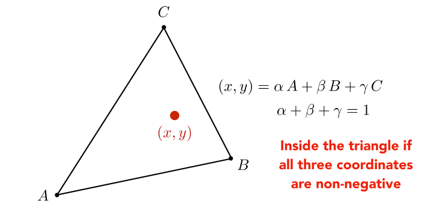
    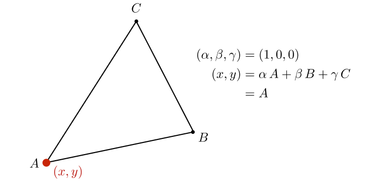

$A,B,C$ 是坐标向量, 例A: (1, 2)
:::

:::info Geometric viewpoint — proportional areas (几何视点-比例面积)
**What’s the barycentric coordinate of the centroid? (质心的重心坐标是什么?)**

    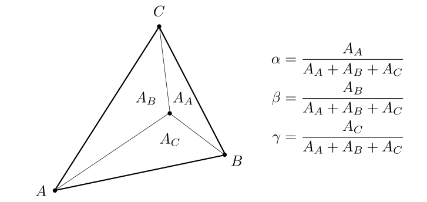
    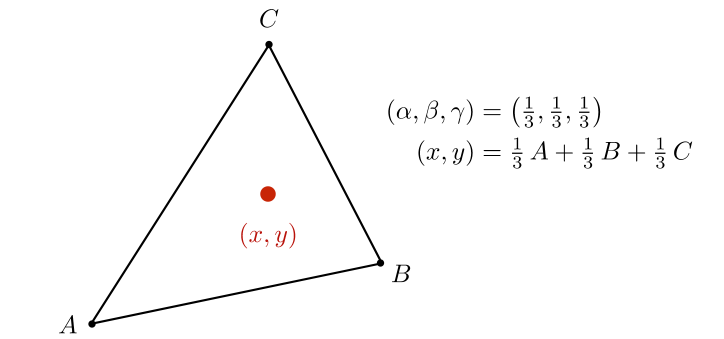

:::

:::tip Formulas

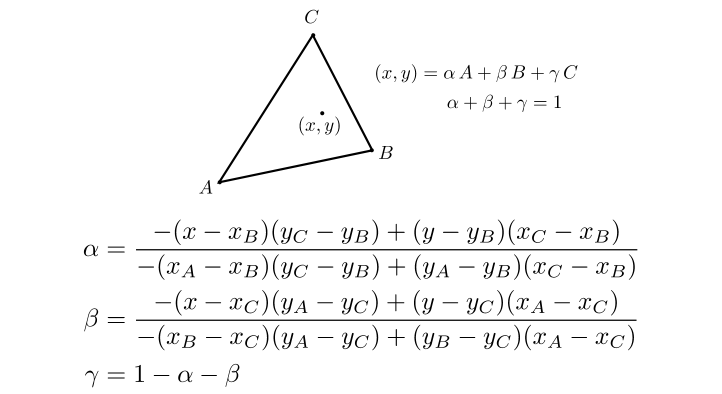
:::
:::tip Using Barycentric Coordinates
Linearly interpolate values at vertices (在顶点处线性插值)
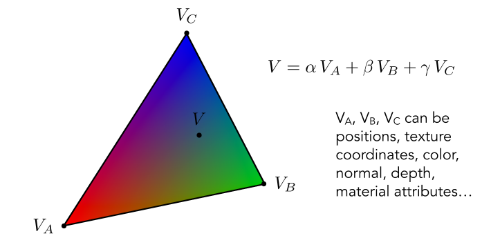

**However, barycentric coordinates are not invariant under projection! (然而，质心坐标在投影下不是不变的!)**
:::

## Applying Textures

### Simple Texture Mapping: Diffuse Color (简单纹理映射:漫反射颜色)

:::info for each rasterized screen sample (x,y): -> Usually a pixel's center

- (u,v) = evaluate texture coordinate at (x,y) -> Using barycentric coordinates!

- texcolor = texture.sample (u, v);

- set sample’s color to texcolor; -> Usually the diffuse albedo Kd(recall the Blinn-Phong reflectance model)

:::

### Texture Magnification (What if the texture is too small?)

#### Easy Case

Generally don’t want this — insufficient texture resolution

A pixel on a texture — a texel(纹理元素、纹素)

    
    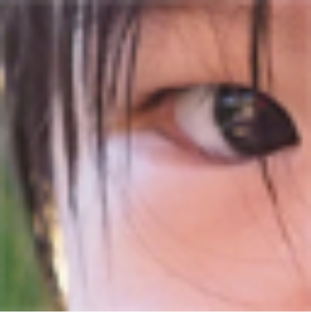
    

    Nearest
    Bilinear
    Bicubic

:::info Bilinear Interpolation (双线性插值)

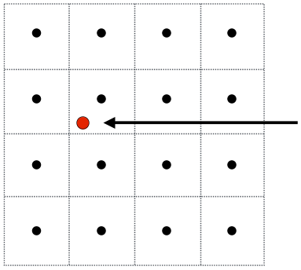

Want to sample texture value f(x,y) at red point (想要取样吗? 纹理值f(x,y)在红点)

Black points indicate texture sample locations (黑点表示纹理样本的位置)

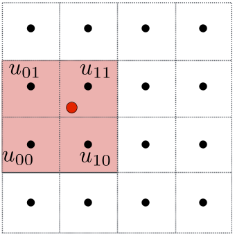

Take 4 nearest sample locations, with texture values as labeled. (取4个最近的样本位置，标记纹理值)

    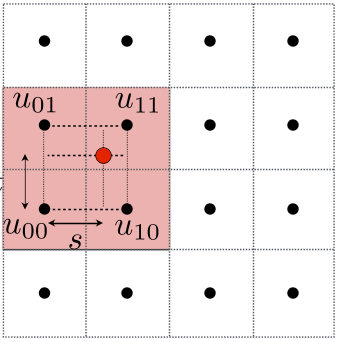
    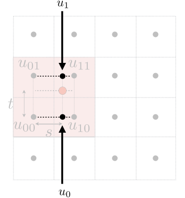
    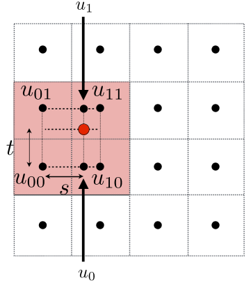

*And fractional offsets, (s,t) as shown (分数偏移量， (s,t)如图所示)*

**Linear interpolation (1D)**

$lerp(x, v_0, v_1) = v_0 + x(v_1 - v_0)$

**Two helper lerps (horizontal)**

$u_0 = lerp(s, u_{00}, u_{10})$

$u_1 = lerp(s, u_{01}, u_{11})$

**Final vertical lerp, to get result:**

$f(x, y) = lerp(t, u_0, u_1)$

**Bilinear interpolation usually gives pretty good results at reasonable costs (双线性插值通常以合理的成本给出相当好的结果)**
:::

### Texture Magnification (What if the texture is too large?)

#### Hard Case

Point Sampling Textures — Problem (点采样纹理-问题)

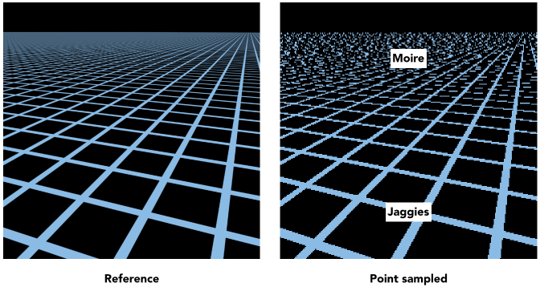

Screen Pixel "Footprint" in Texture (纹理中的屏幕像素"足迹")
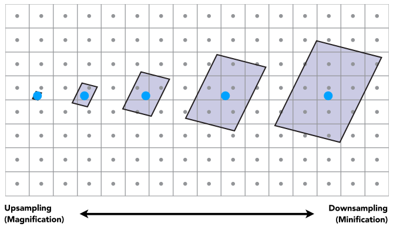

Will Supersampling Do Antialiasing? (超采样会做抗锯齿吗?)
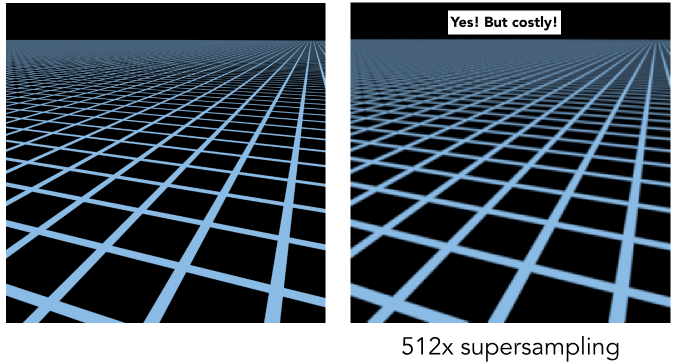

:::info Antialiasing — Supersampling?
Will supersampling work? 
- Yes, high quality, but costly 
- When highly minified, many texels in pixel footprint 
- Signal frequency too large in a pixel 
- Need even higher sampling frequency 

Let’s understand this problem in another way 
- What if we don’t sample? 
- Just need to get the average value within a range!

**Point Query vs. (Avg.) Range Query**
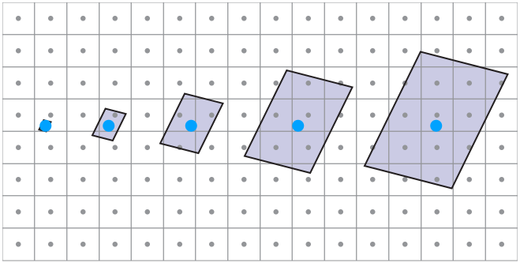

**Different Pixels -> Different-Sized Footprints(不同像素->不同大小的足迹)**
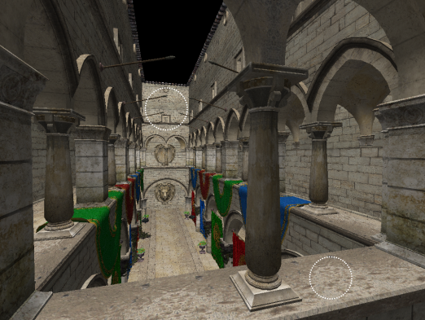

:::

### Mipmap (Allowing (fast, approx., square) range queries)

**"Mip" comes from the Latin "multum in parvo", meaning a multitude in a small space ("Mip"来自拉丁语"multum in parvo"，意思是一个小空间里的许多人)**

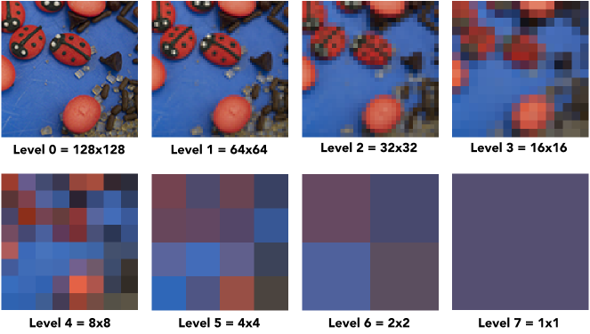

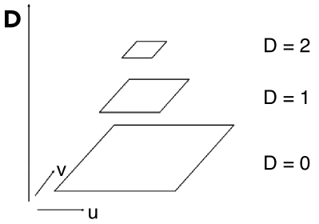

"Mip hierarchy"

level = D

What is the storage overhead of a mipmap?

:::info Computing Mipmap Level D (计算Mipmap级别D)
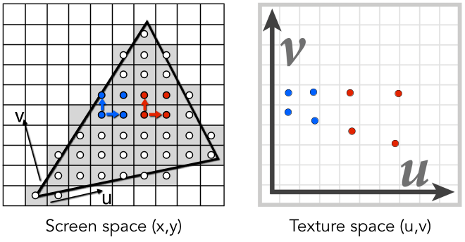

Estimate texture footprint using texture coordinates of neighboring screen samples (使用相邻屏幕样本的纹理坐标估计纹理占用)

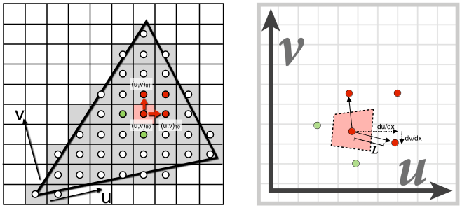
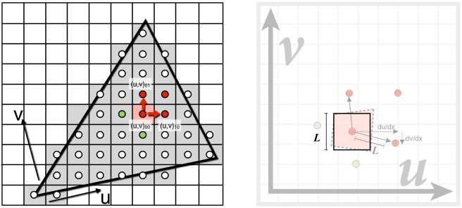

$D = \log_2L$  

$L = max \left(\sqrt{(\frac{du}{dx})^2 + (\frac{dv}{dx})^2}, \sqrt{(\frac{du}{dy})^2 + (\frac{dv}{dy})^2}\right)$

**Visualization of Mipmap Level (Mipmap级别的可视化)**

D rounded to nearest integer level
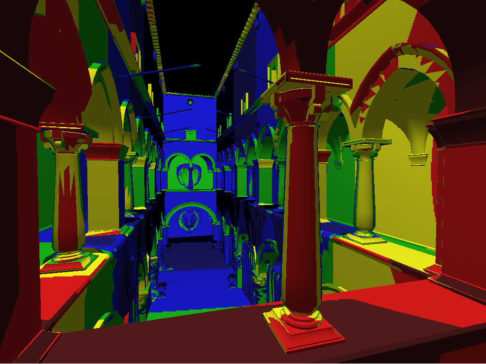

:::

:::info Trilinear Interpolation (三维插值)
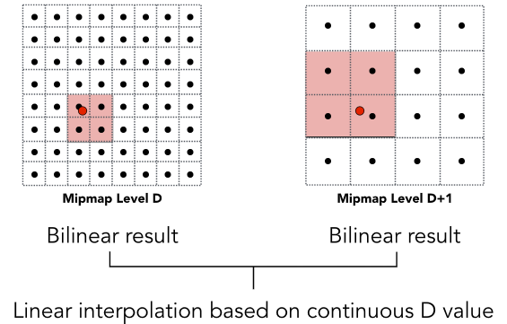

**Visualization of Mipmap Level**

Trilinear filtering: visualization of continuous D
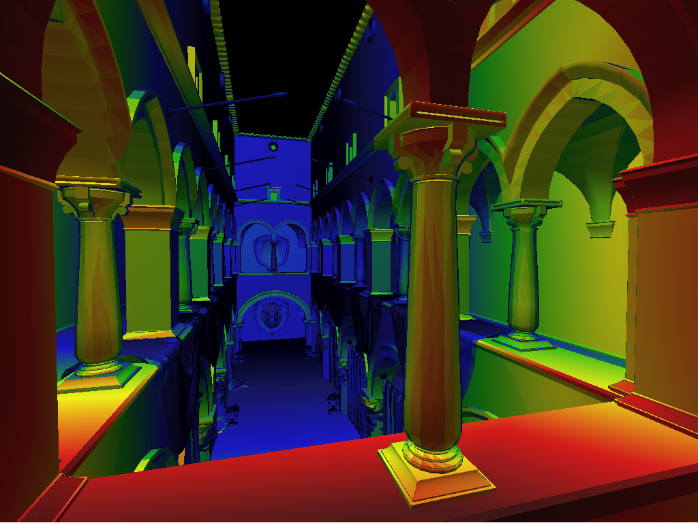
:::

:::info Mipmap Limitations
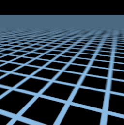
过度模糊

**Anisotropic Filtering (各向异性过滤：一种3D显示技术，通过对周围各个方向上的像素进行取样计算后映射到目标像素上，以提高图像的精度和逼真度。)**
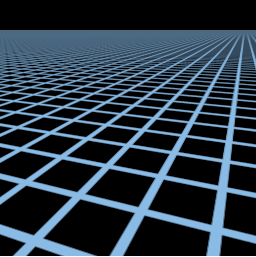

Irregular Pixel Footprint in Texture (纹理中的不规则像素足迹)

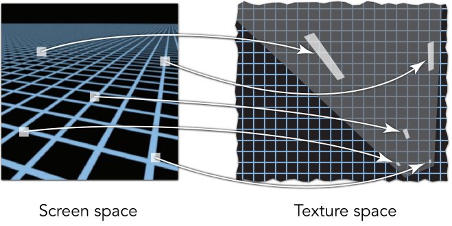

:::

:::info Anisotropic Filtering 
Ripmaps and summed area tables 
- Can look up axis-aligned rectangular zones
- Diagonal footprints still a problem

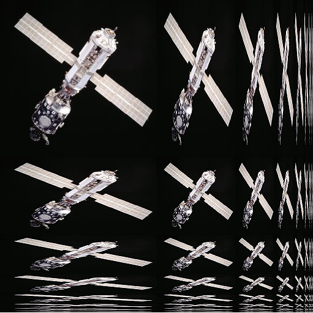

EWA filtering 
- Use multiple lookups 
- Weighted average
- Mipmap hierarchy still helps
- Can handle irregular footprints

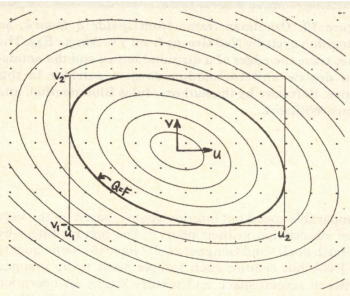

:::

## Applications of textures (应用)

