# Shadow mapping (阴影贴图)

:::info Shadows
- How to draw shadows using rasterization? (如何使用光栅化绘制阴影?)
- Shadow mapping!

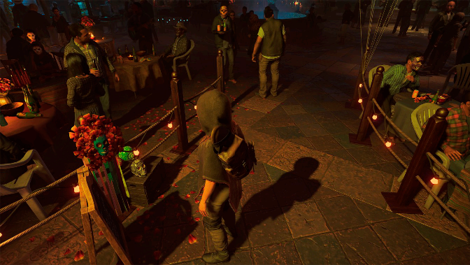

:::

- An Image-space Algorithm (一种图像空间算法) 
    - no knowledge of scene’s geometry during shadow computation  (在阴影计算过程中不了解场景的几何形状)
    - must deal with aliasing artifacts (必须处理混叠工件)

- Key idea: 
    - the points **NOT** in shadow must be seen both **by the light** and **by the camera** (不在阴影中的点必须同时被光线和相机看到)

## 基本流程

- 从光源看向场景并做深度测试
- 从视锥体位置看向场景，从场景中看到的点投影回光源得到该点在深度图中的位置
    - 有些点可以被视锥体看到也可以被光源看到（视锥体投影到的深度图与光源中的深度图相同）
    - 有些点可以被视锥体看到但不能被光源看到（视锥体投影到的深度图与光源中的深度图不符）
- 不能被光源看到的位置但可以被视锥体看到的位置就是阴影的位置

**Pass 1: Render from Light**

- Depth image from light source

    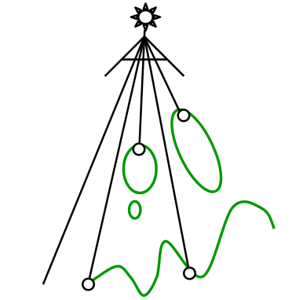
    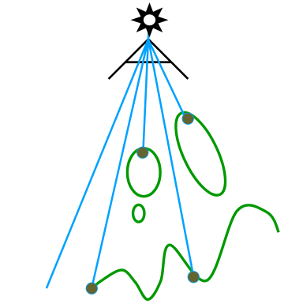

**Pass 2A: Render from Eye**

- Standard image (with depth) from eye

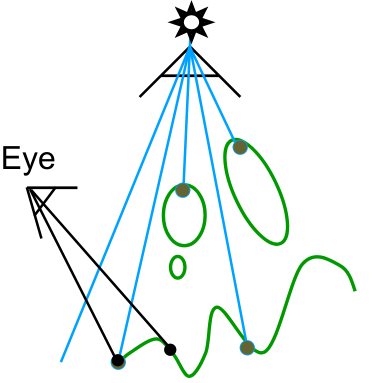

**Pass 2B: Project to light**

- Project visible points in eye view back to light source

    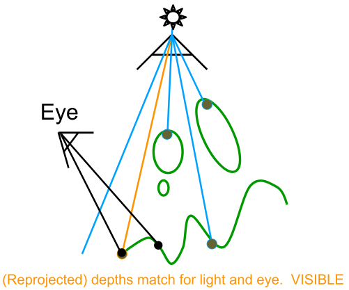
    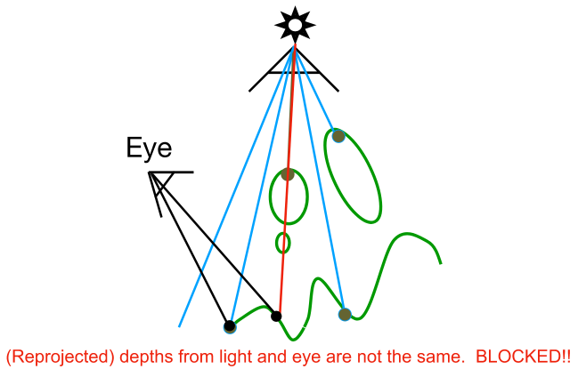

## Visualizing Shadow Mapping (可视化阴影映射)

- A fairly complex scene with shadows

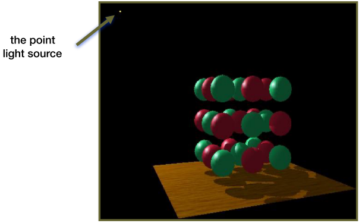

- Compare with and without shadows

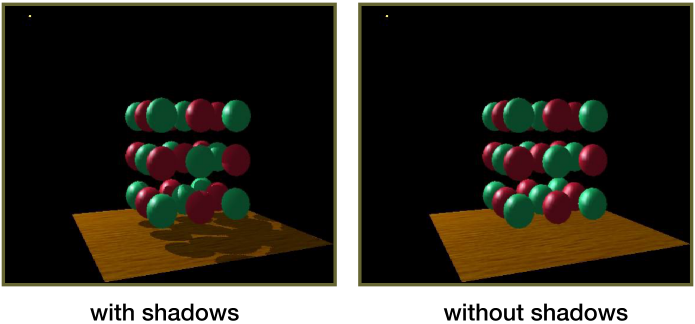

- The scene from the light’s point-of-view

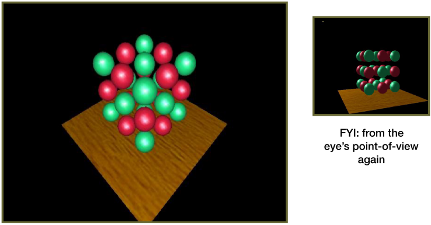

- The depth buffer from the light’s point-of-view

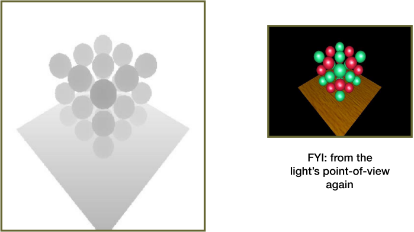

- Comparing Dist(light, shading point) with shadow map

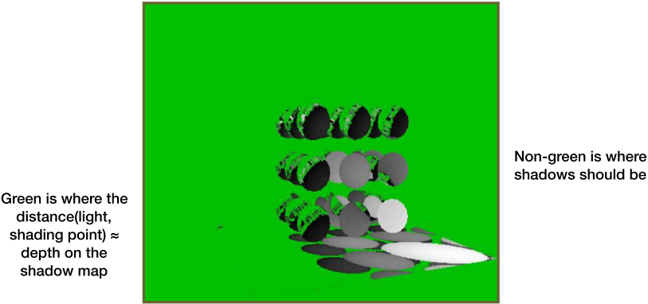

绿色破碎的原因: 浮点数判断相等非常困难

## Problems with shadow maps

- Hard shadows (point lights only) (硬阴影)
- Quality depends on shadow map resolution(general problem with image-based techniques) (质量取决于阴影贴图的分辨率(基于图像的技术的一般问题))
- Involves equality comparison of floating point depth values means issues of scale, bias, tolerance (涉及相等比较浮点深度值意味着尺度，偏差，公差的问题)

:::info Hard shadows vs. soft shadows

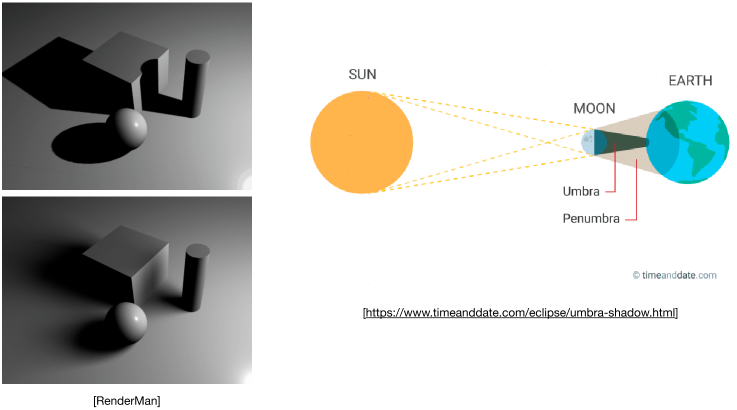

:::
