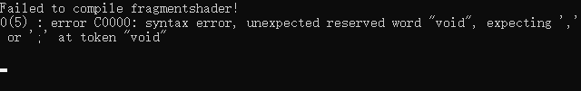

# 07.在OpenGL中写一个着色器

::: tip 本节目标
使用着色器代码对三角形进行编辑。
:::

## 创建着色器

核心是使用OpenGL函数，以下是将这些抽象到自己的函数中，减少重复代码：

``` C++ [Application.cpp]
//目录结构 /OpenGL/src/Application.cpp
static unsigned int CompileShader(unsigned int type, const std::string& source)
{
    unsigned int id = glCreateShader(type);
    const char* src = source.c_str();
    glShaderSource(id, 1, &src, nullptr);
    glCompileShader(id);

    // 错误处理
    int result;
    glGetShaderiv(id, GL_COMPILE_STATUS, &result);
    if (result == GL_FALSE)
    {
        int length;
        glGetShaderiv(id, GL_INFO_LOG_LENGTH, &length);
        char* message = (char*)alloca(length * sizeof(char));
        glGetShaderInfoLog(id, length, &length, message);
        std::cout << "Failed to compile " << (type == GL_VERTEX_SHADER ? "vertex" : "fragment") << "shader!" << std::endl;
        std::cout << message << std::endl;
        glDeleteShader(id);
        return 0;
    }

    return id;
}

static unsigned int CreateShader(const std::string& vertexShader, const std::string& fragmentShader)
{
    unsigned int program = glCreateProgram();
    unsigned int vs = CompileShader(GL_VERTEX_SHADER, vertexShader);
    unsigned int fs = CompileShader(GL_FRAGMENT_SHADER, fragmentShader);

    glAttachShader(program, vs);
    glAttachShader(program, fs);
    glLinkProgram(program);
    glValidateProgram(program);

    glDeleteShader(vs);
    glDeleteShader(fs);

    return program;
}
```

## 编写着色器代码
``` C++ [Application.cpp]
//目录结构 /OpenGL/src/Application.cpp
// 顶点着色器
std::string vertexShader =
     "#version 330 core\n"
     "\n"
     "layout(location = 0) in vec4 position;\n"
     "\n"
     "void main()\n"
     "{\n"
     "   gl_Position = position;\n"
     "}\n";
// 片元着色器
std::string fragmentShader =
     "#version 330 core\n"
     "\n"
     "layout(location = 0) out vec4 color;\n"
     "\n"
     "void main()\n"
     "{\n"
     "   color = vec4(0.2, 0.3, 0.8, 1.0);\n"
     "}\n";

unsigned int shader = CreateShader(vertexShader, fragmentShader);
glUseProgram(shader);
```

## 最终效果


## 着色器代码错误处理


