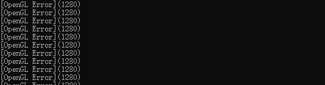
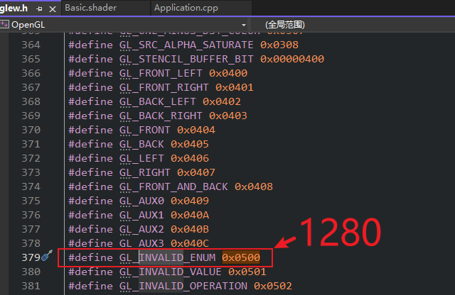
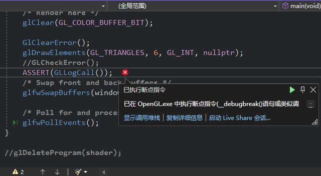
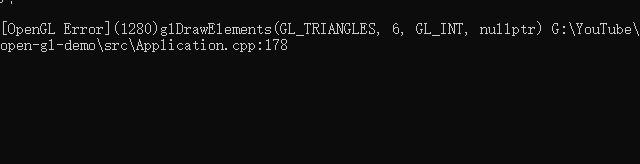

# 10.基础的OpenGL错误监测

## 制造错误
```C++
glDrawElements(GL_TRIANGLES, 6, GL_UNSIGNED_INT, nullptr); // [!code --]
glDrawElements(GL_TRIANGLES, 6, GL_INT, nullptr); // [!code ++]
/* 这导致我们只看到黑屏 */
```

## 错误处理
```C++

static void GlClearError()
{
    while (glGetError() != GL_NO_ERROR);
}

static void GLCheckError()
{
    while (GLenum error = glGetError())
    {
        std::cout << "[OpenGL Error](" << error << ")" << std::endl;
    }
}

GlClearError(); // [!code ++]
glDrawElements(GL_TRIANGLES, 6, GL_INT, nullptr);
GLCheckError(); // [!code ++]
```
`错误CODE`



`具体信息`



## 优化
```C++
#define ASSERT(x) if (!(x)) __debugbreak(); // __ MSVC特有 // [!code ++]
#define GLCall(x) GLClearError();\ // [!code ++]
    x;\ // [!code ++]
    ASSERT(GLLogCall()) // [!code ++]

static void GLCheckError() // [!code --]
static boll GLLogCall() // [!code ++]
{
    while (GLenum error = glGetError())
    {
        std::cout << "[OpenGL Error](" << error << ")" << std::endl;
        return false; // [!code ++]
    }
    return true; // [!code ++]
}

GLCheckError(); // [!code --]
ASSERT(GLLogCall()); // [!code ++]
```
`作用`



## 详细错误
```C++
#define GLCall(x) GlClearError();\
    x;\
    ASSERT(GLLogCall(#x, __FILE__, __LINE__))

/* 详细错误 */
static bool GLLogCall(const char* function, const char* file, int line)
{
    while (GLenum error = glGetError())
    {
        std::cout << "[OpenGL Error](" << error << ")" << function <<
            " " << file << ":" << line << std::endl;
        return false;
    }
    return true;
}
```
`效果`


