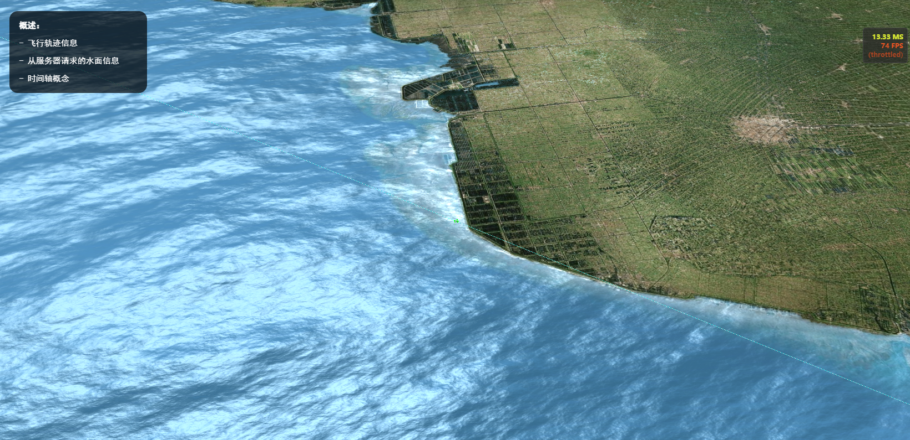

## 简介
使用`Cesium`与前后端实时通信技术（WebSocket等）实现实时轨迹效果，适用于`船舶/飞机`实时位置显示，轨迹追踪。

## 效果截图


## 实现-mars3d

在使用`mars3d SDK`时，实现的方式比较简单，有以下几种实例对象都支持添加动态位置：

- BasePointEntity/BasePointPrimitive
- BillboardEntity/BillboardPrimitive
- PointEntity/PointPrimitive
- ModelEntity/ModelPrimitive
- LabelEntity/LabelPrimitive
- Route

`仅LabelPrimitive、PointPrimitive、BillboardPrimitive、ModelPrimitive 等部分子类支持`

``` js
/**
 * 添加动态位置
 * @param point LngLatPoint | Cesium.Cartesian3 | Array.<number>
 * @param currTime Cesium.JulianDate | Date | string | number
 */
graphic.addDynamicPosition(point, currTime)
```

## 实现-cesium 

`//Todo`
