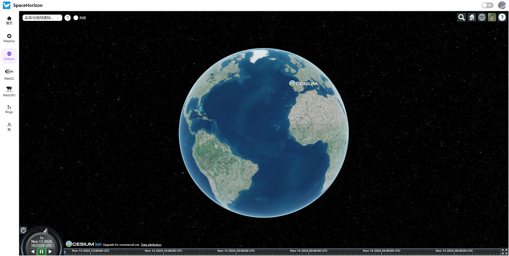
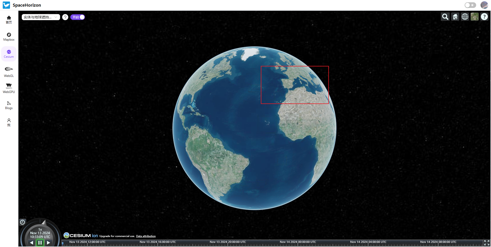

# 实体与地球遮挡关系优化

## 问题背景

全局开启地形深度测试后部分实体会被地形遮挡，对实体单独设置深度测试参数时会导致实体在地球背面依旧可见。

## 解决方案

手动计算实体与地球的遮挡关系；

具体：计算两个向量夹角

``` JavaScript
// 全局开启深度与地形测试
viewer.scene.globe.depthTestAgainstTerrain = true

//对Entity实体开启按距离深度测试
const entity = viewer.entities.add({
    position: position,
    billboard: {
        image:"img path",
        disableDepthTestDistance: Number.POSITIVE.INFINITY
    }
}

/**
 * 判断实体是否在地球背面，在背面则隐藏
 * @todo 目前是单个实体，能否高效地对场景内期望的实体全部设置
 * @param {Entity} entity
 */
const hideEntityEarthBack = (entity) => {
    viewer.scene.preRender.addEventListener(function () {
        // 获取相机的世界坐标
        const cameraPosition = viewer.scene.camera.position;
        // 获取实体的世界坐标
        const entityPosition = entity.position.getValue(viewer.clock.currentTime);
        // 地心(地球中心)的坐标为(0，0，0)，可以用这个来判断方向
        const earthCenter = new Cesium.Cartesian3(0, 0. 0);
        // 计算相机与实体的向量
        const cameraToEarth = Cesium.Cartesian3.subtract(
            cameraPosition, 
            entityPosition,
            new Cesium.Cartesian3()
        );
        //计算实体与地球中心的向量
        const entityToEarth = Cesium.Cartesian3.subtract(
            entityPosition, 
            earthCenter,
            new Cesium.Cartesian3()
        );
        // 计算这两个向量的点积
        const dotProduct = Cesium.Cartesian3.dot(
            cameraToEarth, 
            entityToEarth
        );
        //当 dotProduct < 0 时，实体在地球背面
        entity.show = dotProduct > 0;
    })
}

```

## 效果图
未开启：


开启：
