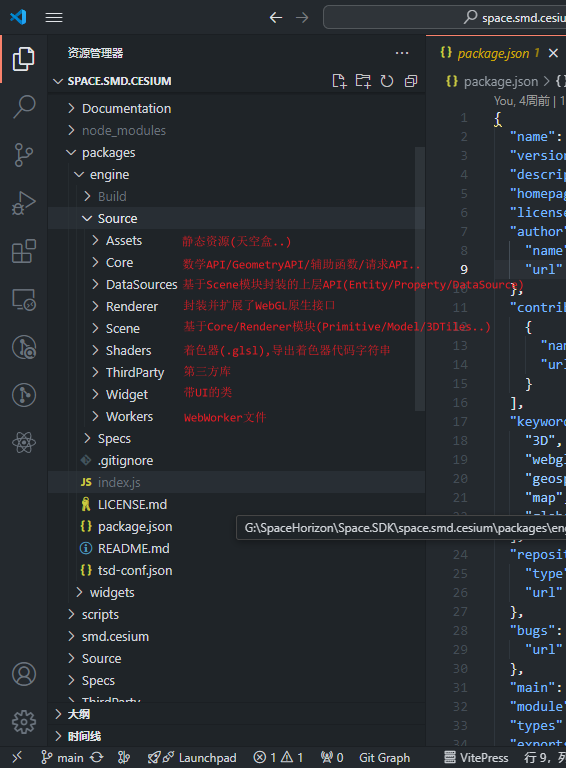

# CesiumJS源码解析

## 目录结构

官方解释

- @cesium/engine - CesiumJS's core, rendering, and data APIs
- @cesium/widgets - A widgets library for use with CesiumJS

Todo: 根目录下的结构

## Step 1

## Step 2

## Step 3

## Step 4

## ...
