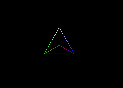

# 生成模型

## BufferGeometry

```JavaScript
//创建顶点坐标
const vertices = [new THREE.Vector3(0, 0, 0), new THREE.Vector3(1, 0, 0), new THREE.Vector3(0, 1, 0), new THREE.Vector3(0, 0, 1)];
//顶点索引
//为了减少内存复制，需要用到索引缓冲区，以允许重用顶点
const indices = [2, 1, 0, 0, 1, 3, 1, 2, 3, 3, 2, 0];
//创建顶点颜色
const colors = [new THREE.Color(0xff0000), new THREE.Color(0x00ff00), new THREE.Color(0x0000ff), new THREE.Color(0xffffff)];
// 创建几何体
const geometry = new THREE.BufferGeometry();
geometry.setAttribute(
  "position",
  new THREE.Float32BufferAttribute(
    vertices.flatMap((v) => [v.x, v.y, v.z]),
    3
  )
);
geometry.setIndex(indices);
geometry.setAttribute(
  "color",
  new THREE.Float32BufferAttribute(
    colors.flatMap((c) => [c.r, c.g, c.b]),
    3
  )
);

// 创建材质
const material = new THREE.MeshBasicMaterial({
  vertexColors: true, //启用顶点颜色
  wireframe: true, //线框模式?
});

// 创建网格模型
const mesh = new THREE.Mesh(geometry, material);

// 将模型添加到场景中
scene.add(mesh);
```

::: info 结果

:::
