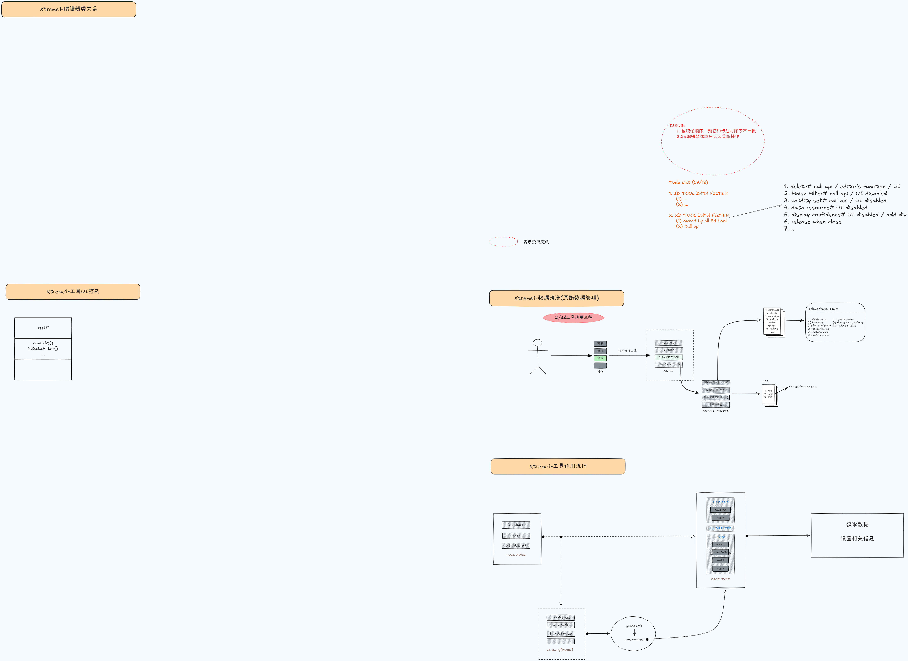

# Threejs In (Xtreme1/...)

## Xtreme1

### 类

::: info 用到的Threejs类

主要
- [THREE.EventDispatcher](https://threejs.org/docs/index.html?q=EventDispatcher#api/zh/core/EventDispatcher)
- [THREE.Group](https://threejs.org/docs/index.html?q=group#api/zh/objects/Group)
- [THREE.Scene](https://threejs.org/docs/index.html?q=sc#api/zh/scenes/Scene)
- [THREE.RawShaderMaterial](https://threejs.org/docs/index.html?q=RawShaderMaterial#api/zh/materials/RawShaderMaterial)
- [THREE.Object3D](https://threejs.org/docs/index.html?q=Object3D#api/zh/core/Object3D)
- ...

次要
- [THREE.Box3Helper](https://threejs.org/docs/index.html?q=helper#api/zh/helpers/Box3Helper)
- [THREE.PlaneHelper](https://threejs.org/docs/index.html?q=helper#api/zh/helpers/PlaneHelper)
- [THREE.Color](https://threejs.org/docs/index.html?q=Color#api/zh/math/Color)
- [THREE.AxesHelper](https://threejs.org/docs/index.html?q=AxesHelper#api/zh/helpers/AxesHelper)
:::

### 第三方库

[Tweenjs]()
## ...

### 架构图
